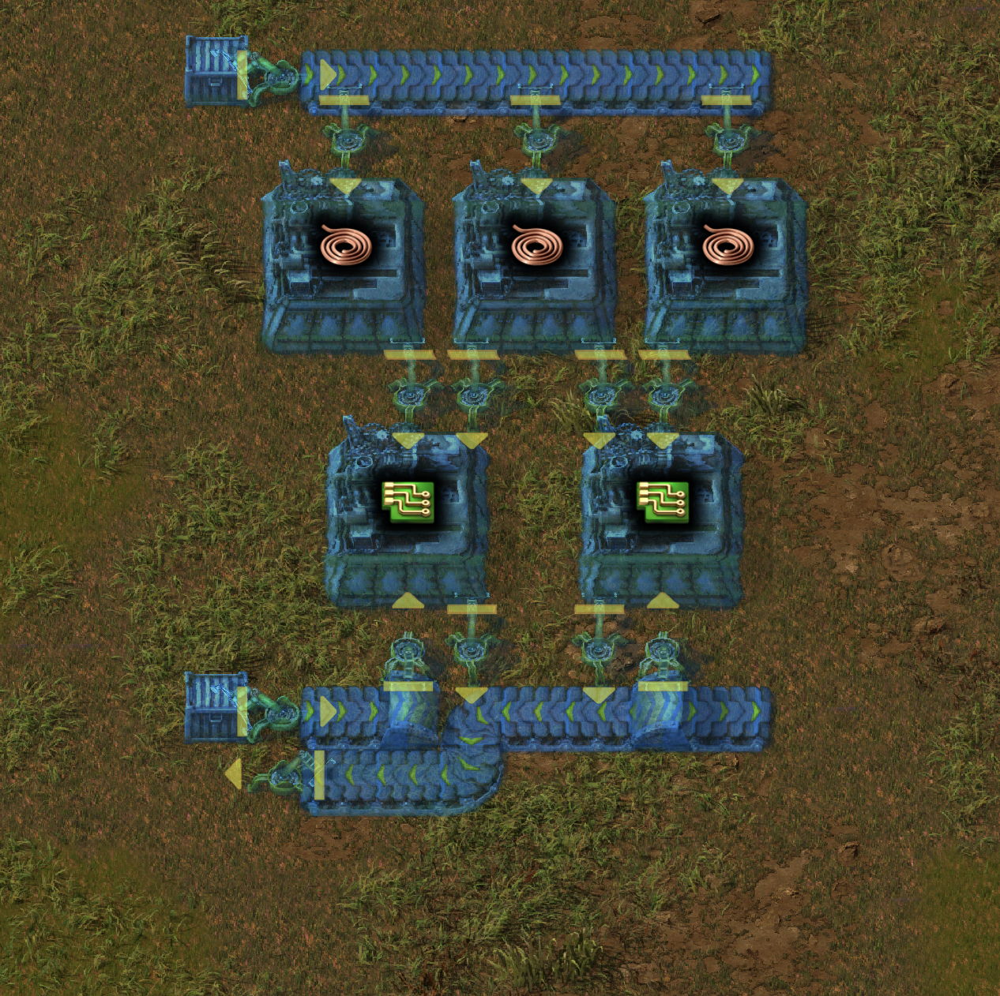
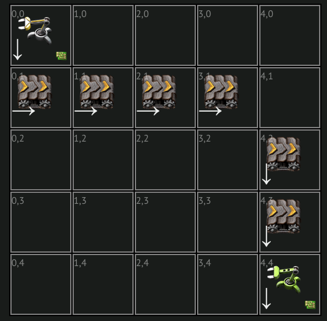
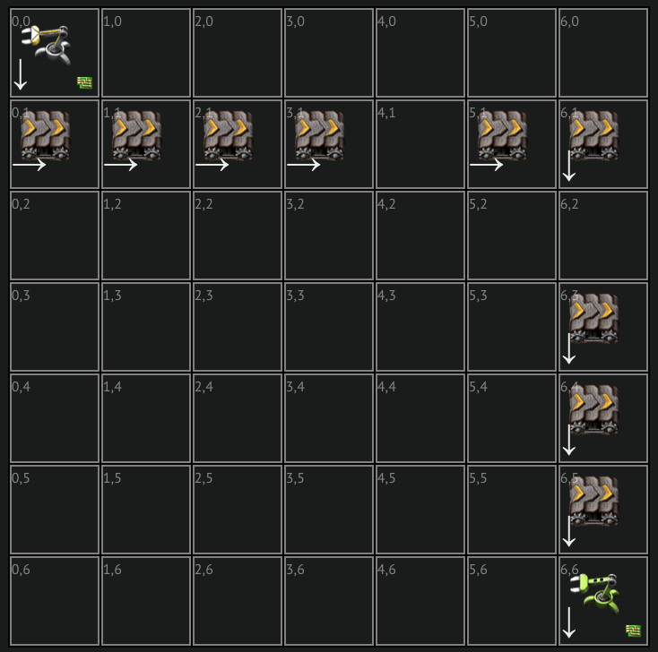
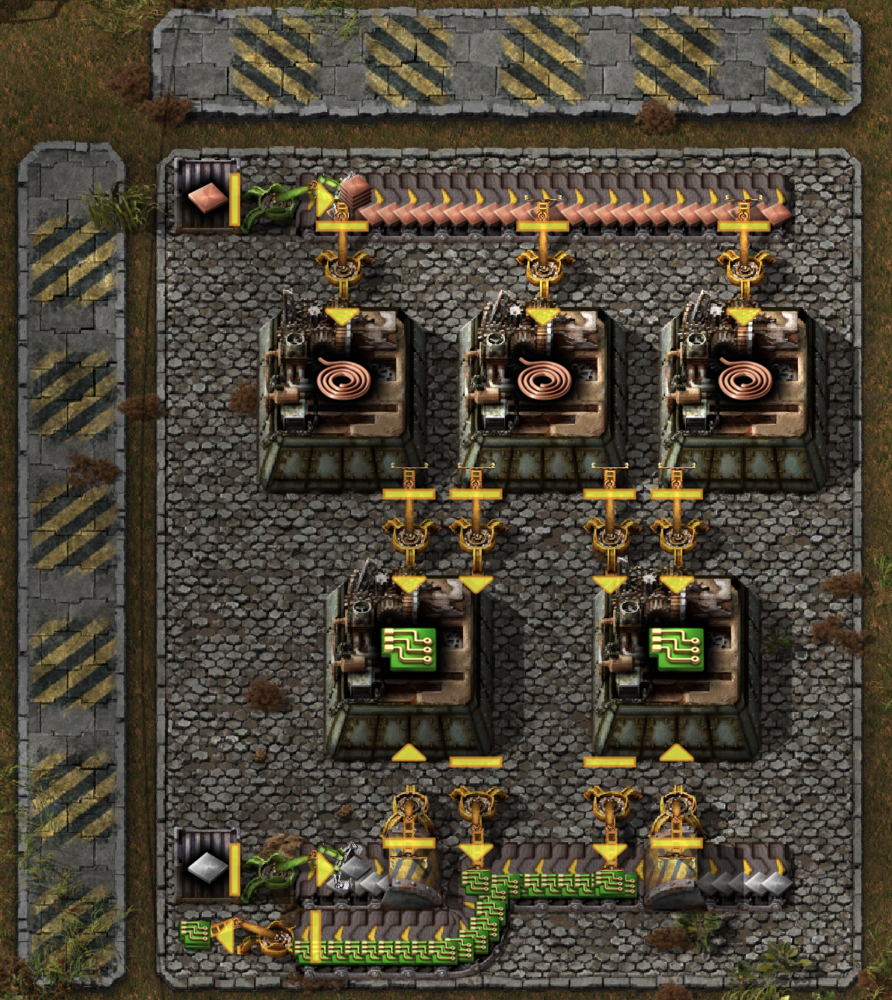
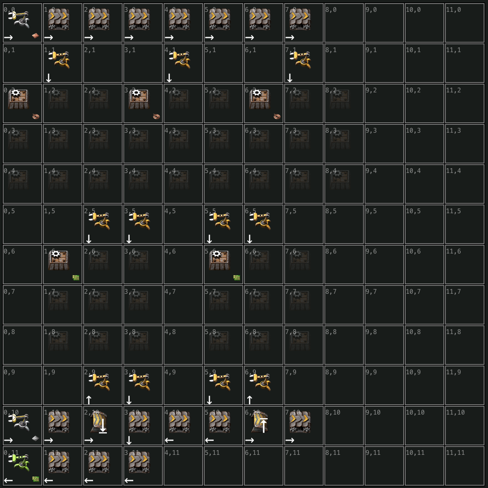
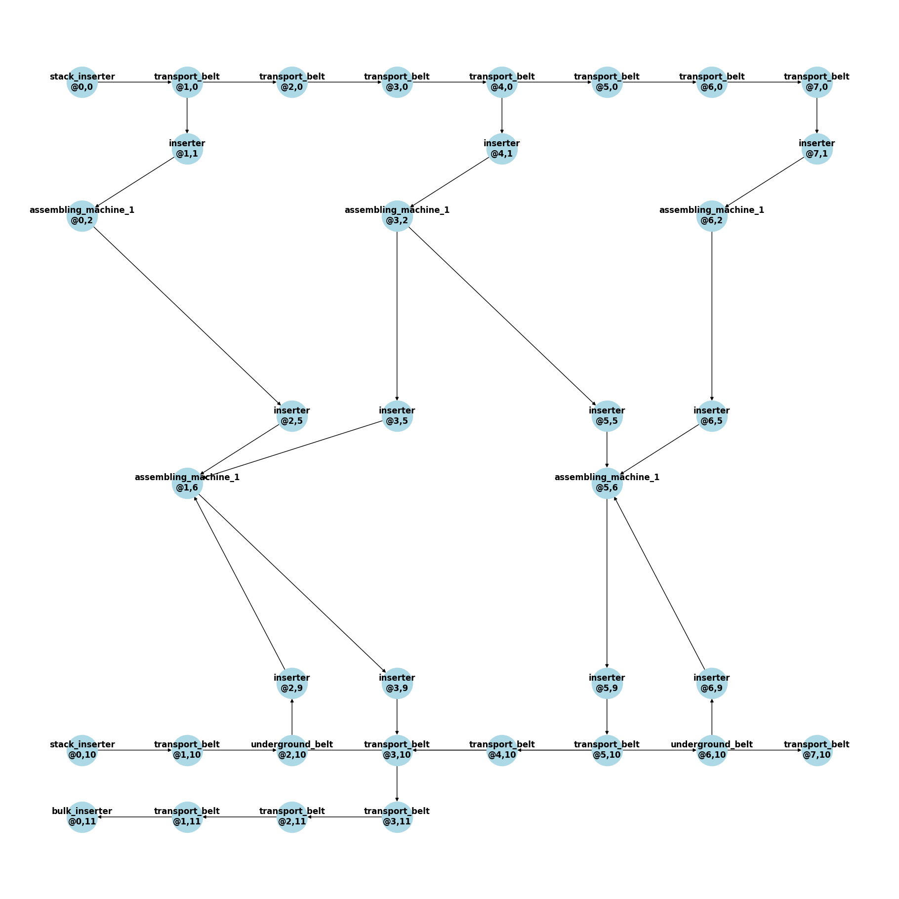
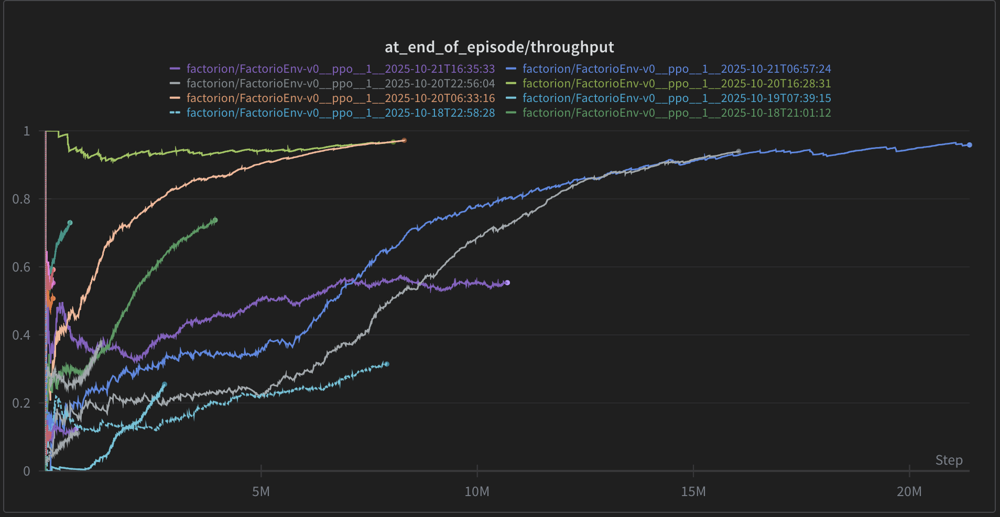

# Factorion: An RL Agent for Building Factories

This project is an experiment in using Reinforcement Learning (RL) to train an
agent that can build high-throughput factories in an environment inspired by
the game Factorio.

The ultimate goal is to create an agent that, given a defined buildable area, a
"source" tile for inputs, and a "sink" tile for outputs, can autonomously
design and build a factory. This involves placing all the necessary assembling
machines, power poles, transport belts, etc. to transform the input items into
the desired output items, optimising for maximum production throughput of the
output items.

> **Note:** This project is under heavy development. The codebase is
> experimental and will not be held to the same quality standards as my more
> mature projects (e.g., https://github.com/beyarkay/eskom-calendar).



Weights & Biases report (a few months out of date, 2025-04-29, current work has
progressed significantly): https://api.wandb.ai/links/beyarkay/wmccb7fq

## What is Factorio?

Factorio is a popular 2D tile-based top-down PC game centred on automation and
logistics. Players start by manually mining basic resources like iron and
copper ore. They then use these resources to build machines, which in turn
automate production processes. The core gameplay loop involves designing and
expanding intricate "factories" - complex webs of machines, conveyor belts, and
robotic arms - to produce increasingly sophisticated items, from simple gears to
rocket components. The game presents a significant logistical and design
challenge, making it an interesting domain for an autonomous RL agent.

## The Reinforcement Learning Problem

Instead of integrating directly with the game (which would be prohibitively
slow for training), this project uses a basic implementation of core Factorio
mechanics. Currently this is in python, but will be rewritten in C/Rust before
the next scale-up of agent training as roll-out times are becoming a
bottleneck.

### The Environment: `FactorioEnv`

The agent operates within a grid-world environment that simulates a small patch
of the Factorio game world.

- **State/Observation Space**: The environment's state is represented as a 3D
  tensor of shape `(Channels, Width, Height)`. It's a grid where each cell `(x, y)`
  has several channels describing its contents. Key channels include:

  - `ENTITIES`: An integer ID for the machine or belt in that cell (e.g.,
    transport belt, assembler).
  - `DIRECTION`: The orientation of the entity (e.g., North, East, South,
    West).
  - `ITEMS`: The recipe an assembler is set to, or the item an inserter is
    filtering for.
  - `MISC`: Used for special entity states, like the direction of an
    underground belt.

- **Action Space**: The agent interacts with the environment by placing one
  entity at a time. Each turn, the agent outputs a discrete action composed of:

  - `xy`: The coordinates for the placement.
  - `entity`: The type of entity to place.
  - `direction`: The orientation of the entity.

- **Reward Signal**: After the agent has finished placing entities (or the
  episode times out), the resulting factory is evaluated. A custom graph-based
  algorithm simulates the flow of items through the constructed belts and
  machines to calculate the factory's final **throughput** (items produced per
  second). This throughput value serves as the primary reward signal. The agent
  is thus incentivized to create designs that are not just connected, but
  efficient.

#### An example 5x5 environment with one transport-belt missing



#### An example 7x7 environment with two transport-belts missing



### Curriculum learning

To reduce the sparsity of the reward (even mostly-correct factories can result
in zero throughput and therefore zero reward), a curriculum learning approach
is taken. Basic factories (as simple as a series of transport belts that are
all connected) are auto-generated using hand-written factory-generation code,
and then entities are removed from the known-correct factory. At first, zero or
one entities are removed, so the agent only has to place one entity (or ensure
it doesn't remove an entity) in order to receive a reward. As the agent
improves, more and more entities are removed from the known-correct factory,
until only the input and output tiles remain.

### The Agent: `AgentCNN`

The agent's policy is represented by a Convolutional Neural Network (CNN). This
architecture is well-suited for processing grid-based, spatial data like our
environment.

- **Input**: The network takes the environment's `(Channels, Width, Height)`
  tensor as input.
- **Architecture**: The agent uses a series of convolutional layers to extract
  spatial features from the factory layout. The output of the convolutional
  encoder is then fed into several separate linear heads.
- **Output**:
  - **Actor Heads**: There are separate output heads for each component of the
    action space (`x`, `y`, `entity`, `direction`), predicting a probability
    distribution over the possible choices for each.
  - **Critic Head**: A single value head outputs an estimate of the expected
    future reward from the current state, which is used during training.

## Current Status and Future Goals

The project is progressing by gradually increasing the complexity of the tasks
the agent must solve. Currently, the focus is on training the agent to solve a
fundamental logistics problem: placing transport belts on increasingly-sized
grids to create an unbroken path from a source to a sink. The agent is
successfully able to place transport belts on 7x7 grids. The grid size will
increase until we reach an 11x11 grid, which is the smallest required to fit a
basic green-circuits factory:

#### **Green circuit factory in factorio**

Here is the (intermediate) goal: The input is 1. the copper plates in the
top-left steel chest and 2. the iron plates in the bottom left steel chest. The
output is the green electronic circuit, in the very bottom left corner. All 36
entities must be precisely placed, otherwise the throughput of the factory will
be zero.



#### **Green circuit factory in tensor representation**

The agent sees the factory something like the below image. Directions, recipes,
and entity IDs are all encoded in the third dimension of the tensor:



#### **Green circuit factory in graph representation**

In order to calculate the throughput of a factory, a graph is created from the
tensor based on factorio's game logic, and then the min-flow of that graph is
calculated to give the throughput of the factory. A debug representation of the
graph for the green-circuits factory is given below:



## Next steps:

1.  Increasing world size to present more complex path finding problems.
2.  Introducing more entities, such as inserters, assembling machines,
    underground belts, power poles.
3.  Moving towards more complex tasks, such as building a complete production
    line to transform copper and iron plates into electronic circuits.

## Running the Code

```bash
uv pip install -r requirements.txt
source .venv/bin/activate
python ppo.py \
    --seed 1 \
    --env-id factorion/FactorioEnv-v0 \
    --track \
    --wandb-project-name factorion \
    --total-timesteps 500000
```

Most runs that get to any level of ability take at least 4 hours of my M1
macbook pro.

## Notable runs / logbook (very rough from here on out)

Note: about 250 runs have been done so far, this is a significantly reduced
summary. I'll do a proper write-up once there's not so many gains to be had
from researching more. All metrics are done through Weights & Biases.



### 5x5 world, 150k timesteps, world is perfect beforehand

Git hash: 0fb32039cbe9b07355c9a2fb20d66e2bba39c19f

https://wandb.ai/beyarkay/factorion/runs/z5v42zmk?nw=nwuserbeyarkay

##### The throughput of this run over time


##### The actions of the model over time


With these settings, the model slowly figures out how to not mess itself up. It
is given a perfect world, it just has to learn not to touch anything and it'll
get a perfect score. Some points:

- `at_end_of_episode/throughput` is basically stagnant at 0.25 until around
  850k global steps, at which point it starts getting better. This isn't great
  for fast iteration/testing of ideas, because it'll take a long time to
  experiment before we can figure out if something good or not.
- `at_end_of_episode/frac_invalid_actions` keeps rising, and looking at
  `actions/entity` and `actions/direction`, it looks like the model has learnt
  to place a transport belt without a direction as a way of doing a no-op,
  which will never have a bad effect on the map. Whereas placing an actual
  empty entity might cause it to remove the existing belts.

### 2025-10-31 Trying to train a 7x7 model

https://wandb.ai/beyarkay/factorion/runs/nikxsaj6/panel/s7a2nkqwz?nw=nwuserbeyarkay

It's learning, but it just never quite gets past the ~0.8 throughput barrier,
so never sees more than 1 entity missing.

### 2025-10-30 Sweep for speed

https://wandb.ai/beyarkay/factorion/sweeps/6zvjlntl?nw=nwuserbeyarkay

Did sweep to figure out how to go fast

### 2025-10-29 Size-of-model test

See if the size of the model has an effect on how quickly it learns a 6x6
world, comparing ymhimm2c (32-32-32-128) with r6p0mc0y (48-48-48-256). So the
larger model learnt faster? I wasn't expecting that. And it learnt more, in the
same time it managed to get to 8 entities removed, as opposed to just 6.

### 2025-10-28 5x5 world, 500k timesteps, sampling num_missing_entities from increasing range

This run took ~6.5M global steps to pass 0.5 throughput, but at 12M global
steps it had figured out how to get >0.9 throughput with every entity missing

https://wandb.ai/beyarkay/factorion/runs/wmgng3jl/panel/s7a2nkqwz?nw=nwuserbeyarkay
