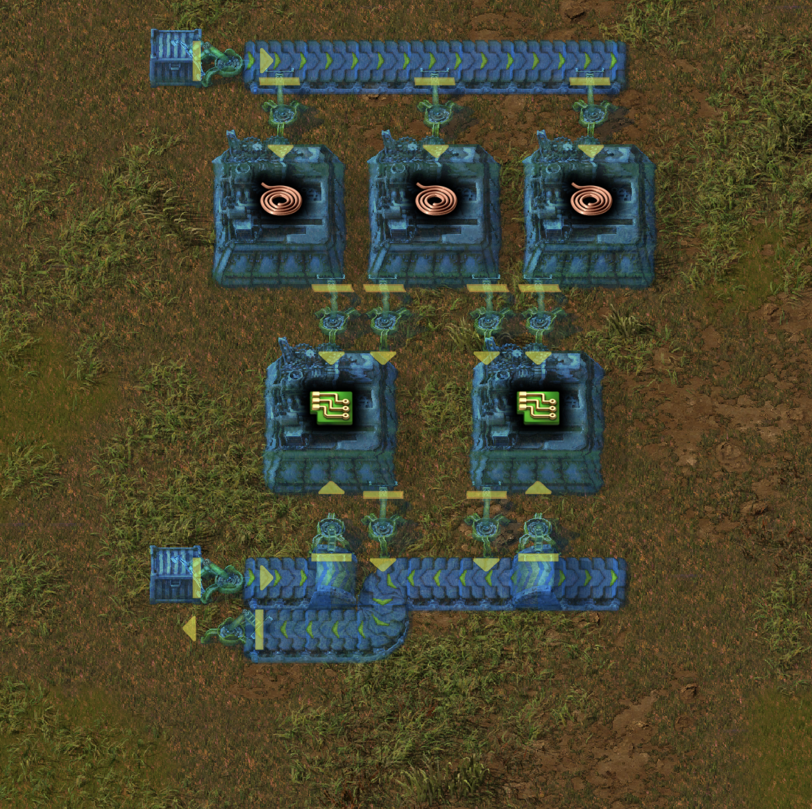
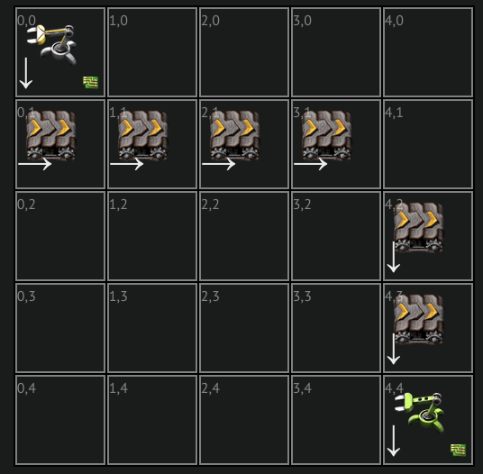
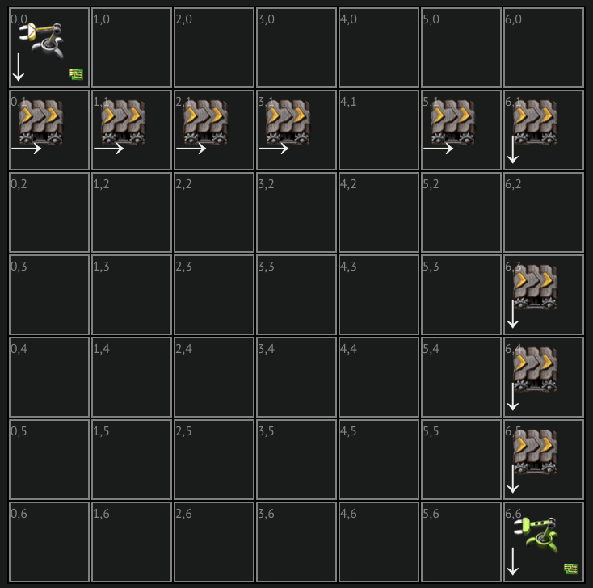
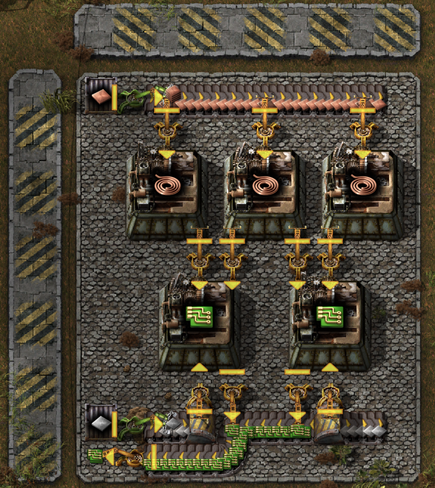
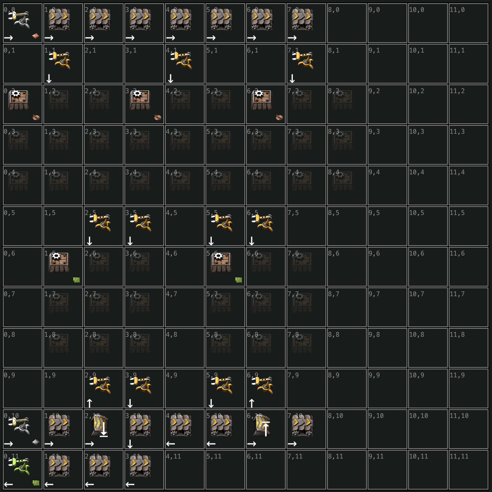
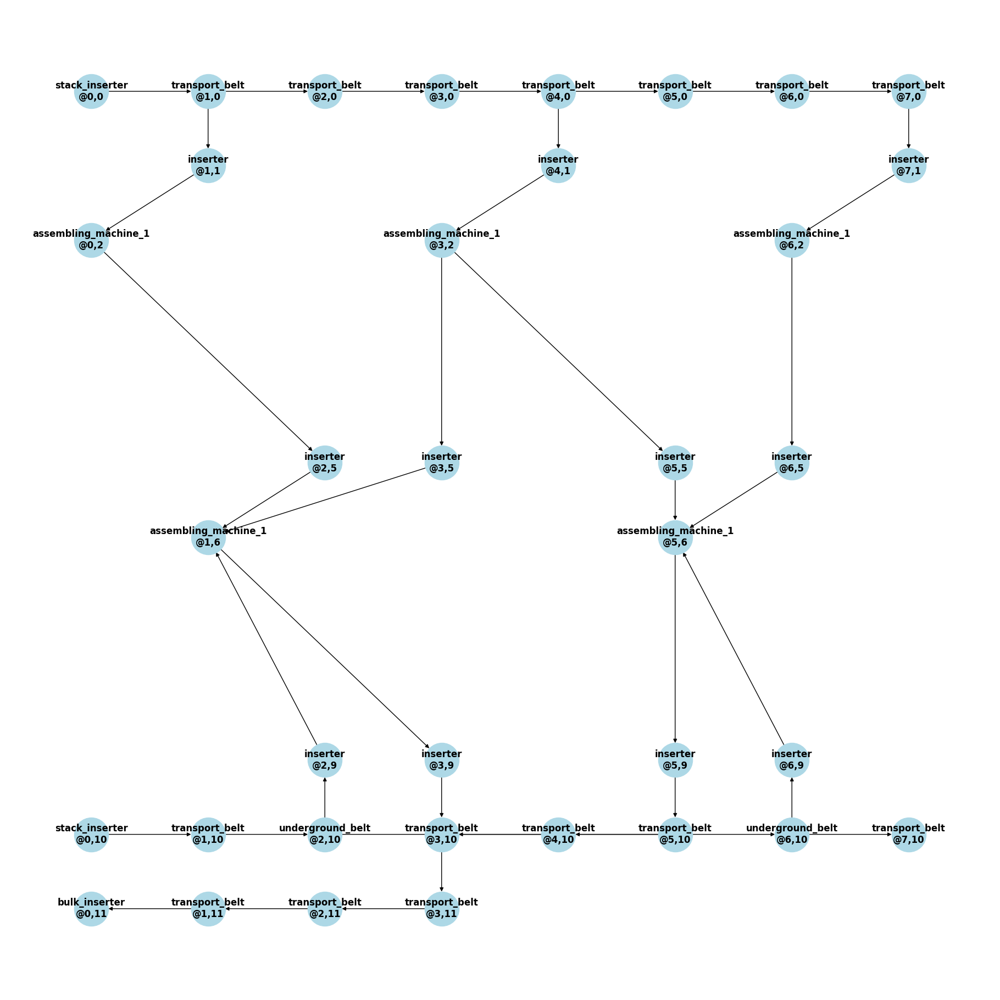

# Factorion: An RL Agent for Building Factories

This project is an experiment in using Reinforcement Learning (RL) to train an
agent that can build high-throughput factories in an environment inspired by
the game Factorio.

The ultimate goal is to create an agent that, given a defined buildable area, a
"source" tile for inputs, and a "sink" tile for outputs, can autonomously
design and build a factory. This involves placing all the necessary assembling
machines, power poles, transport belts, etc. to transform the input items into
the desired output items, optimising for maximum production throughput of the
output items.

> **Note:** This project is under heavy development. The codebase is
> experimental and will not be held to the same quality standards as my more
> mature projects (e.g., https://github.com/beyarkay/eskom-calendar).



Weights & Biases report (a few months out of date, 2025-04-29, current work has
progressed significantly): https://api.wandb.ai/links/beyarkay/wmccb7fq

## Recent additions

What's landed on `main` in the last week, newest first.

**2026-06-30**

- Added a new training task that makes the model memorise recipes by rebuilding a randomly-chosen assembler fed and drained by source/belt/inserter arms, plus a shared `render_factory` helper for drawing factories as ASCII ([#213](https://github.com/beyarkay/factorion/pull/213))
- Added a "cross under a protected belt line" training task with a native-Rust generator and an underground-aware router that tunnels beneath obstacles ([#199](https://github.com/beyarkay/factorion/pull/199))
- Added the long-handed inserter as a placeable entity, with reach-2 connectivity ([#212](https://github.com/beyarkay/factorion/pull/212))
- Fixed multi-tile entity placement so state is written uniformly across the whole footprint ([#214](https://github.com/beyarkay/factorion/pull/214))
- Ported the factory generator (`build_factory`) to Rust with byte-identical parity and removed the old Python implementation, so all training now goes through the faster Rust path ([#202](https://github.com/beyarkay/factorion/pull/202), [#210](https://github.com/beyarkay/factorion/pull/210))
- Sped up SFT training (88.4 → 22.6 s, −74%) with a training-loop benchmark and GPU-resident data ([#206](https://github.com/beyarkay/factorion/pull/206))
- Sped up PPO with numpy world-writes, recipe `Args` defaults, and an entity-string cache ([#205](https://github.com/beyarkay/factorion/pull/205))
- Allowed CPU training under pytest so the PPO/SFT tests run locally without a GPU ([#211](https://github.com/beyarkay/factorion/pull/211))
- Defaulted CI to RTX 2000 Ada + CUDA-13-capable hosts and fixed the CI Docker image ([#208](https://github.com/beyarkay/factorion/pull/208))
- Sped up the python-tests CI install with `uv` and dropped unused dependencies ([#209](https://github.com/beyarkay/factorion/pull/209))
- Fixed a stuck loop in the SFT rollout-eval test fixture ([#207](https://github.com/beyarkay/factorion/pull/207))

**2026-06-29**

- Cut PPO time-to-quality from ~63 s to ~41 s by replacing `torch.distributions` with fused sampling ops and compiling the rollout, bootstrap, and update passes with CUDA graphs
- Added a time-to-quality finetuning benchmark with durable, discoverable history alongside the existing pure-speed benchmark
- Added `--critic-lr-mult` for a separate critic learning rate, and `--amp` (bf16 autocast) plus `--async-envs` flags (off by default)

**2026-05-13**

- Made the "build one assembler" training task actually hide the assembler so the model has to learn to place it ([#108](https://github.com/beyarkay/factorion/pull/108))
- Added an evaluation step during supervised pre-training that rolls out the model's greedy predictions and measures the resulting factory's throughput ([#109](https://github.com/beyarkay/factorion/pull/109))
- Tuned the supervised pre-training sweep with cosine LR schedule, AdamW, gradient clipping, and per-output-head loss weights ([#104](https://github.com/beyarkay/factorion/pull/104))

**2026-05-12**

- Added a binary "I'm done placing entities" output head so the agent can decide when to stop ([#103](https://github.com/beyarkay/factorion/pull/103))
- Scaled the supervised pre-training smoke test up to 300k samples on an 11×11 grid ([#102](https://github.com/beyarkay/factorion/pull/102))
- Built an interactive page for inspecting the model's predictions, and added W&B checkpoint uploads ([#100](https://github.com/beyarkay/factorion/pull/100))
- Moved throughput computation into a Rust implementation for a big speedup ([#99](https://github.com/beyarkay/factorion/pull/99))
- Dropped the marimo notebook wrapper so `factorion.py` is a plain importable module ([#98](https://github.com/beyarkay/factorion/pull/98))
- Made the agent predict all four channels of an entity placement (tile, entity type, item/recipe, orientation) ([#96](https://github.com/beyarkay/factorion/pull/96))
- Logged per-task validation metrics and a per-head loss breakdown during pre-training ([#97](https://github.com/beyarkay/factorion/pull/97))
- Added a new training task: routing belts under obstacles using underground belts ([#82](https://github.com/beyarkay/factorion/pull/82))
- Set up the Claude Code GitHub Actions workflow ([#94](https://github.com/beyarkay/factorion/pull/94))
- Added a `crafting_time` field to the recipe data model ([#92](https://github.com/beyarkay/factorion/pull/92))

**2026-05-11**

- Added a hotbar, keyboard shortcuts, and auto-recompute to the factory-builder web UI ([#86](https://github.com/beyarkay/factorion/pull/86))

**2026-05-10**

- Shipped an interactive drag-and-drop factory builder for designing and inspecting layouts in the browser ([#85](https://github.com/beyarkay/factorion/pull/85))
- Expanded the item catalogue with 55 new items and 43 new recipes from the wiki ([#80](https://github.com/beyarkay/factorion/pull/80))

**2026-05-08**

- Added 50 wiki-sourced icons for entities, items, and modules ([#79](https://github.com/beyarkay/factorion/pull/79))
- Fixed a data leak where one of the input channels was telling the model where the answer was supposed to go ([#81](https://github.com/beyarkay/factorion/pull/81))
- Ran a supervised pre-training smoke test on then-current main as a baseline ([#77](https://github.com/beyarkay/factorion/pull/77))
- Added a training task for assemblers with one input and one output, and unified recipes/items behind a single Rust source of truth ([#78](https://github.com/beyarkay/factorion/pull/78))
- Fixed how belt corners are drawn, and added filter flags to the data-visualisation script ([#76](https://github.com/beyarkay/factorion/pull/76))
- Landed the initial supervised pre-training pipeline and deduplicated the RunPod CI setup ([#47](https://github.com/beyarkay/factorion/pull/47))
- Made consecutive belts render as a single visual chain in the HTML factory view ([#73](https://github.com/beyarkay/factorion/pull/73))
- Fixed the env step so multi-tile entities fill their full footprint on the grid ([#72](https://github.com/beyarkay/factorion/pull/72))
- Added an optional `highlights` argument to the HTML factory renderer ([#71](https://github.com/beyarkay/factorion/pull/71))
- Added a script for visualising samples of the supervised-training dataset ([#70](https://github.com/beyarkay/factorion/pull/70))
- Made ffmpeg video capture opt-in via `--capture-video` ([#69](https://github.com/beyarkay/factorion/pull/69))
- Documented Factorio's two-lane belt mechanics in the wiki reference ([#64](https://github.com/beyarkay/factorion/pull/64))

## What is Factorio?

Factorio is a popular 2D tile-based top-down PC game centred on automation and
logistics. Players start by manually mining basic resources like iron and
copper ore. They then use these resources to build machines, which in turn
automate production processes. The core gameplay loop involves designing and
expanding intricate "factories" - complex webs of machines, conveyor belts, and
robotic arms - to produce increasingly sophisticated items, from simple gears to
rocket components. The game presents a significant logistical and design
challenge, making it an interesting domain for an autonomous RL agent.

## The Reinforcement Learning Problem

Instead of integrating directly with the game (which would be prohibitively
slow for training), this project uses a basic implementation of core Factorio
mechanics. Currently this is in python, but will be rewritten in C/Rust before
the next scale-up of agent training as roll-out times are becoming a
bottleneck.

### The Environment: `FactorioEnv`

The agent operates within a grid-world environment that simulates a small patch
of the Factorio game world.

- **State/Observation Space**: The environment's state is represented as a 3D
  tensor of shape `(Channels, Width, Height)`. It's a grid where each cell `(x, y)`
  has several channels describing its contents. Key channels include:

  - `ENTITIES`: An integer ID for the machine or belt in that cell (e.g.,
    transport belt, assembler).
  - `DIRECTION`: The orientation of the entity (e.g., North, East, South,
    West).
  - `ITEMS`: The recipe an assembler is set to, or the item an inserter is
    filtering for.
  - `MISC`: Used for special entity states, like the direction of an
    underground belt.

- **Action Space**: The agent interacts with the environment by placing one
  entity at a time. Each turn, the agent outputs a discrete action composed of:

  - `xy`: The coordinates for the placement.
  - `entity`: The type of entity to place.
  - `direction`: The orientation of the entity.

- **Reward Signal**: After the agent has finished placing entities (or the
  episode times out), the resulting factory is evaluated. A custom graph-based
  algorithm simulates the flow of items through the constructed belts and
  machines to calculate the factory's final **throughput** (items produced per
  second). This throughput value serves as the primary reward signal. The agent
  is thus incentivized to create designs that are not just connected, but
  efficient.

#### An example 5x5 environment with one transport-belt missing



#### An example 7x7 environment with two transport-belts missing



### Training pipeline: SFT pretraining, then RL finetuning

The project is moving toward an LLM-style two-stage training pipeline:

**Stage 1 — Data generation via lessons.** Hand-written factory generators
(`generate_lesson()` in `factorion.py`) produce known-correct factories and
then blank out N entities from them. The result is a stream of
*(partial-factory, correct-completion)* training pairs. Each **lesson type**
covers a different entity/layout pattern:

- `MOVE_ONE_ITEM`, `ALL_BELTS_ALREADY_IN_PLACE` — belt routing
- `SPLITTER_SPLIT`, `SPLITTER_MERGE` — flow splitting/merging via 2×1
  splitters
- (planned) underground belts, crossings, assembling machines

Each lesson also has an **internal difficulty knob**: `num_missing_entities`
ranges from 0 (full solution shown) up to all placeable entities (only the
source/sink remain). Lesson *type* and difficulty are orthogonal — the agent
sees diverse scenarios at every difficulty level.

**Stage 2 — Supervised pre-training (SFT).** A multi-head classifier (tile +
entity + direction) is trained on the lesson pairs via cross-entropy loss.
This gives the policy a strong prior: it already "knows" how inserters
connect belt segments, how splitters divide flow, etc., before any RL
happens.

**Stage 3 — RL finetuning.** PPO (`ppo.py`) loads the SFT checkpoint and
refines the policy to maximise actual throughput — pushing beyond the
lesson-generator's solutions when a better layout exists. Starting from a
decent pretrained policy means the sparse-reward problem (most factories
throughput=0) bites much less than in the original RL-from-scratch setup.
Point `--start-from` at either a local `.pt` file or a W&B run id (e.g. an SFT
run like `j0s5y2mc`, whose model artifact is fetched automatically), and use
`--critic-warmup` to train the fresh value head before unfreezing the policy.
The aim is for PPO to beat the SFT base's `val/thput_eot`.

Historically the project trained RL from scratch with an explicit curriculum
that ramped `num_missing_entities` over time. That scaffolding still exists
but its role is shifting: the curriculum axis becomes a data-sampling knob
during SFT, and RL gets to skip early levels when loading an SFT checkpoint.

### The Agent: `AgentCNN`

The agent's policy is represented by a Convolutional Neural Network (CNN). This
architecture is well-suited for processing grid-based, spatial data like our
environment.

- **Input**: The network takes the environment's `(Channels, Width, Height)`
  tensor as input.
- **Architecture**: The agent uses a series of convolutional layers to extract
  spatial features from the factory layout. The output of the convolutional
  encoder is then fed into several separate linear heads.
- **Output**:
  - **Actor Heads**: There are separate output heads for each component of the
    action space (`x`, `y`, `entity`, `direction`), predicting a probability
    distribution over the possible choices for each.
  - **Critic Head**: A single value head outputs an estimate of the expected
    future reward from the current state, which is used during training.

## Current Status and Future Goals

The project is progressing by gradually increasing the complexity of the tasks
the agent must solve. Currently, the focus is on training the agent to solve a
fundamental logistics problem: placing transport belts on increasingly-sized
grids to create an unbroken path from a source to a sink. The agent is
successfully able to place transport belts on 7x7 grids. The grid size will
increase until we reach an 11x11 grid, which is the smallest required to fit a
basic green-circuits factory:

#### **Green circuit factory in factorio**

Here is the (intermediate) goal: The input is 1. the copper plates in the
top-left steel chest and 2. the iron plates in the bottom left steel chest. The
output is the green electronic circuit, in the very bottom left corner. All 36
entities must be precisely placed, otherwise the throughput of the factory will
be zero.



#### **Green circuit factory in tensor representation**

The agent sees the factory something like the below image. Directions, recipes,
and entity IDs are all encoded in the third dimension of the tensor:



#### **Green circuit factory in graph representation**

In order to calculate the throughput of a factory, a graph is created from the
tensor based on factorio's game logic, and then the min-flow of that graph is
calculated to give the throughput of the factory. A debug representation of the
graph for the green-circuits factory is given below:



## Next steps:

1.  Increasing world size to present more complex path finding problems.
2.  Introducing more entities, such as inserters, assembling machines,
    underground belts, power poles.
3.  Moving towards more complex tasks, such as building a complete production
    line to transform copper and iron plates into electronic circuits.

## Running the Code

```bash
uv sync
uv run python ppo.py \
    --seed 1 \
    --env-id factorion/FactorioEnv-v0 \
    --track \
    --wandb-project-name factorion \
    --total-timesteps 500000
```

Most runs that get to any level of ability take at least 1 hour on my M1
macbook pro.

## Factorio environment rewrite/overhaul

Still need to add:

- Assembling machines: This one will be a doozy. assembling machines are 3x3,
  and take input items _only_ by inserters (not by transport belt) and then
  they wait for the correct number of ingredients (e.g. 3 copper cable + 2 iron
  plate) and then consume those ingredients to create the product (e.g.
  electronic circuit). So to represent it we'll have to represent the recipe
  that the assembling machine has on a different channel.

  Then the lessons will first choose a random recipe (I'll dump a bunch of
  recipes into context, or maybe you can search for some?)

- Underground belts: These entities are like belts but go for up to 4 tiles
  underground e.g. `bbbd____ubbb` where b is belt, d is descending underground,
  `_` is an empty tile, u is ascending underground, and b is belt. Note that
  these undergrounds have two forms of rotation: the belt can be
  ascending/descending, and can be rotated so that the opening of the
  underground faces north/south/east/west. Probably we just have an ascending
  underground belt entity and a descending underground belt.

  Then the lessons for these are tricky, we want to ensure the agent learns
  that underground belts are only useful to get _under_ something, but we don't
  really have things that it makes sense to go underneath just yet. But later
  on this'll be other parts of the factory, assembling machines, inserters, or
  other belts. So we won't create "dummy" entities for the underground belts to
  go under, this will need to be real scenarios in which underground belts are
  required.

- Maybe also an "ores" layer?
- Belts having two sides
- Some entities being sources/sinks themselves (miners, science labs, nuclear
  power stations, coal furnaces)
- long inserters

Also:

- have the factory logic live in FactorioEnv
- Speed is important, look at rust with pyO3
- don't always assume 1x1 sized entities

Eventually, the layers will look like:

- Entity ID (maybe this should be combined with rotation?)
- Rotation
- Recipe (for assembling machines)
- Ore

Ignoring:

- Circuit conditions
- Trains/railways
- All of space age (quality, new recipes, new planets)
- Fluids
- Robots/logistics
- Biters
- modules
- filters (on inserters, splitters)

And then also want a way of visualising this nicely, for debugging.

## Factorio Wiki Reference

The `wiki/` directory contains pre-parsed reference docs from the Factorio wiki
covering the game mechanics relevant to this project. AI assistants working on
this codebase should read `wiki/README.md` to understand how Factorio entities
work and how Factorion simplifies them.

## Experiments

See [tests/benchmarks/EXPERIMENT_LOG.md](tests/benchmarks/EXPERIMENT_LOG.md) for a
detailed log of benchmark results and speed experiments, and
[tests/benchmarks/CLAUDE.md](tests/benchmarks/CLAUDE.md) for how to run the
benchmarks.
