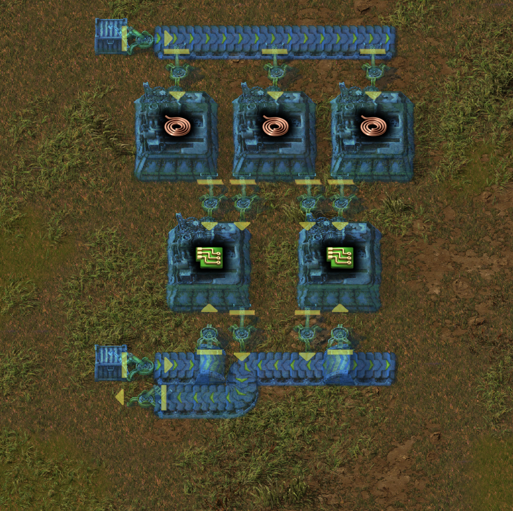
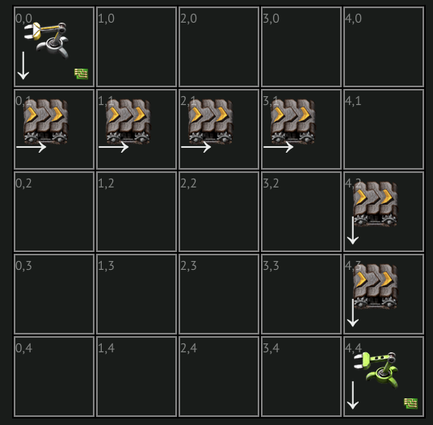
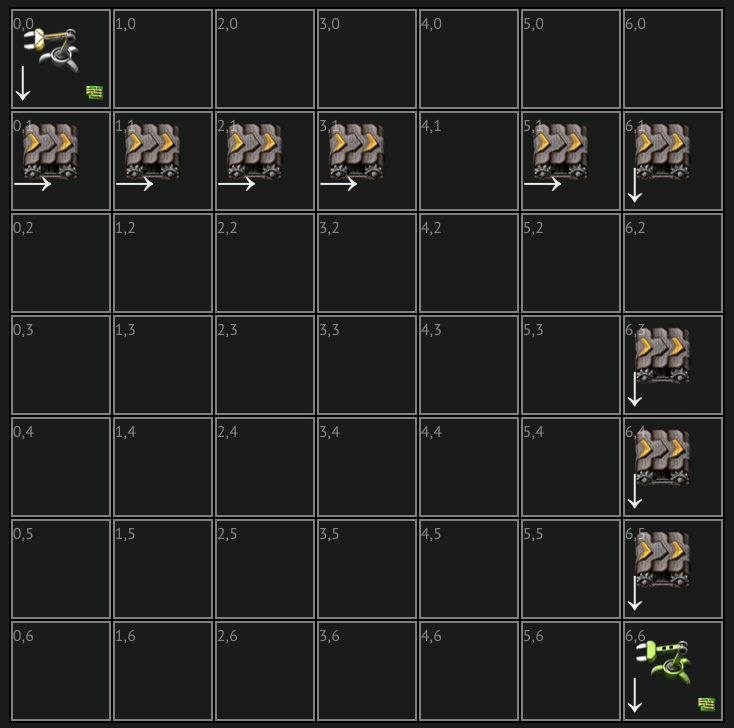
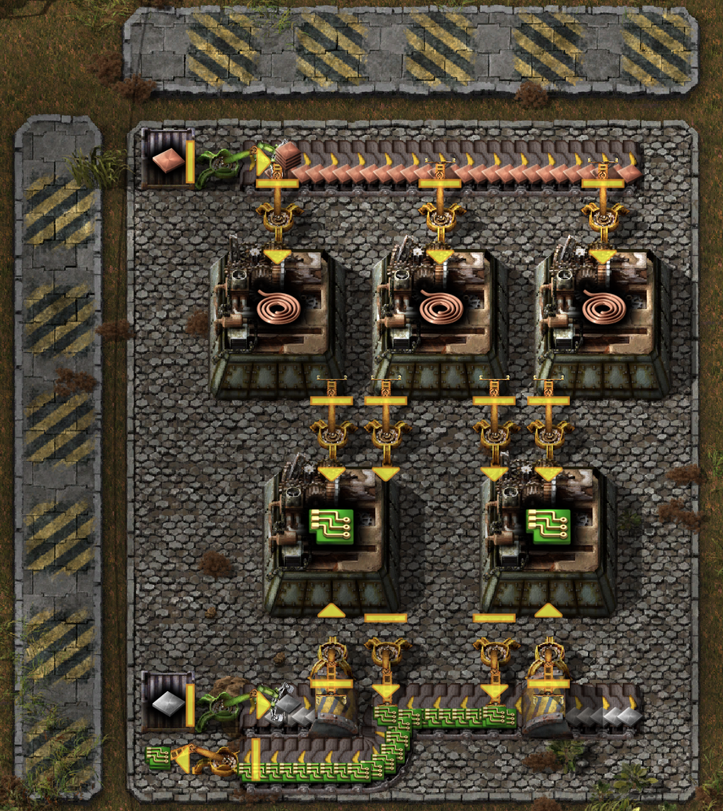
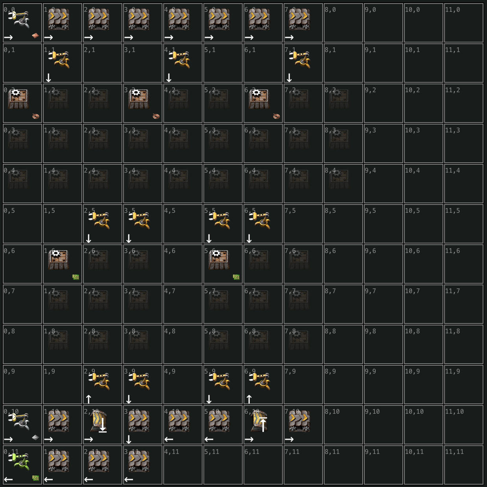
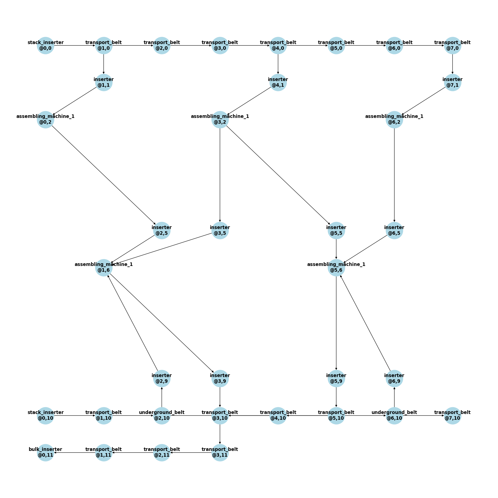

# Factorion: An RL Agent for Building Factories

This project is an experiment in using Reinforcement Learning (RL) to train an
agent that can build high-throughput factories in an environment inspired by
the game Factorio.

The ultimate goal is to create an agent that, given a defined buildable area, a
"source" tile for inputs, and a "sink" tile for outputs, can autonomously
design and build a factory. This involves placing all the necessary assembling
machines, power poles, transport belts, etc. to transform the input items into
the desired output items, optimising for maximum production throughput of the
output items.

> **Note:** This project is under heavy development. The codebase is
> experimental and will not be held to the same quality standards as my more
> mature projects (e.g., https://github.com/beyarkay/eskom-calendar).



Weights & Biases report (long out of date, 2025-04-29; current work has
progressed significantly): https://api.wandb.ai/links/beyarkay/wmccb7fq

## Where things stand (2026-08-02)

The pipeline is SFT pretraining followed by PPO finetuning, on an 11×11 grid.
Headline numbers, all from W&B project `beyarkay/factorion`:

- **SFT base `hcozpmwt`** (100M samples).
- **PPO lifts that to ≈0.78** (`eval/thput`, 3 seeds × 2.5M timesteps,
  2026-07-30). Belt and "memorise this recipe" lessons are essentially solved
  (0.9–1.0); `FACTORY_1_INGREDIENT` is the weak one at ~0.3.
- **Building from markers alone is still unsolved.** The `TRIAL_*` kinds hand
  the agent nothing but source and sink markers — no reference solution to
  imitate, and one source per ingredient of the target recipe. Depth-1 trials
  score ~0.11; depth-2 and depth-3 are still exactly 0. This is the number that
  actually matters, and it is the open problem.
- Multi-hour PPO runs are not reliably better than short ones — a 40M-step run
  _degraded_ from 0.68 to 0.42. [#339](https://github.com/beyarkay/factorion/issues/339)
  measures why (a lesson that pays 25% for doing nothing, plus an end-of-turn
  head that truncates exploration ~16×).

## Recent additions

What's landed on `main` recently, newest first.

**2026-07-30**

- Sampled one belt route per lesson instead of enumerating every shortest one ([#349](https://github.com/beyarkay/factorion/pull/349))
- Made the greedy eval stop as soon as the model's end-of-turn head fires, matching PPO and the builder UI ([#350](https://github.com/beyarkay/factorion/pull/350))
- Added a "scan seeds" tab that rebuilds many blanked factories at once ([#351](https://github.com/beyarkay/factorion/pull/351))

**2026-07-27**

- Added **trials**: RL-only lesson kinds with no known solution, scored separately from lessons ([#344](https://github.com/beyarkay/factorion/pull/344))

**2026-07-25**

- Log-compressed the terminal reward so lessons with 360× different item rates share gradient fairly ([#336](https://github.com/beyarkay/factorion/pull/336))
- Fixed a nonzero PPO `approx_kl` caused by the attention stack ignoring `--dropout` ([#337](https://github.com/beyarkay/factorion/pull/337))

**2026-07-22 – 2026-07-24**

- Restored canonical recipes and rebalanced the "memorise recipes" lessons ([#335](https://github.com/beyarkay/factorion/pull/335))
- Replaced `SPLITTER_MERGE` with a throughput-honest side-loaded variant where both input arms are actually necessary ([#325](https://github.com/beyarkay/factorion/pull/325))
- Masked invalid action combinations in the policy heads ([#327](https://github.com/beyarkay/factorion/pull/327))
- Unified every sampling path into one `AgentCNN.sample_action` ([#320](https://github.com/beyarkay/factorion/pull/320))

**2026-07-21**

- Added a self-attention stage over the encoded grid so every cell sees every other in one hop — the dominant win in the architecture sweeps ([#314](https://github.com/beyarkay/factorion/pull/314))

**2026-07-11 – 2026-07-14**

- Added a per-entity frugality penalty to the PPO terminal reward ([#295](https://github.com/beyarkay/factorion/pull/295))
- Built an engine↔Factorio parity harness that replays generated factories inside the real game ([#278](https://github.com/beyarkay/factorion/pull/278))

## What is Factorio?

Factorio is a popular 2D tile-based top-down PC game centred on automation and
logistics. Players start by manually mining basic resources like iron and
copper ore. They then use these resources to build machines, which in turn
automate production processes. The core gameplay loop involves designing and
expanding intricate "factories" - complex webs of machines, conveyor belts, and
robotic arms - to produce increasingly sophisticated items, from simple gears to
rocket components. The game presents a significant logistical and design
challenge, making it an interesting domain for an autonomous RL agent.

## The Reinforcement Learning Problem

Instead of integrating directly with the game (which would be prohibitively
slow for training), this project uses a basic implementation of core Factorio
mechanics. The throughput simulation and the lesson generators live in a Rust
extension (`factorion_rs/`, built with PyO3/maturin); the simulator runs
21,000–76,000 factories/second and is no longer the training bottleneck.

### The Environment: `FactorioEnv`

The agent operates within a grid-world environment that simulates a small patch
of the Factorio game world.

- **State/Observation Space**: The environment's state is represented as a 3D
  tensor of shape `(Channels, Width, Height)`. It's a grid where each cell `(x, y)`
  has several channels describing its contents. Key channels include:

  - `ENTITIES`: An integer ID for the machine or belt in that cell (e.g.,
    transport belt, assembler).
  - `DIRECTION`: The orientation of the entity (e.g., North, East, South,
    West).
  - `ITEMS`: The recipe an assembler is set to, or the item an inserter is
    filtering for.
  - `MISC`: Used for special entity states, like the direction of an
    underground belt.
  - `FOOTPRINT`: Whether the cell is buildable at all.

- **Action Space**: The agent interacts with the environment by placing one
  entity at a time. Each turn, the agent outputs a discrete action composed of:

  - `xy`: The coordinates for the placement.
  - `entity`: The type of entity to place.
  - `direction`: The orientation of the entity.
  - `item`: The recipe an assembler is set to.
  - `misc`: Whether an underground belt is an entrance or an exit.
  - `eot`: "This factory is finished" — a real action that ends the episode.

- **Reward Signal**: After the agent ends the episode (or it times out), the
  resulting factory is evaluated. A custom graph-based algorithm simulates the
  flow of items through the constructed belts and machines to calculate the
  factory's final **throughput** (items produced per second). The reward is
  that throughput, divided by an entity-cost penalty (so the agent cannot buy
  throughput with unlimited entities) and then log-compressed — solved lessons
  differ ~360× in achievable items/second, and without compression the belt
  lessons would receive two orders of magnitude more gradient than the
  assembler ones. The agent is thus incentivized to create designs that are not
  just connected, but efficient and frugal.

#### An example 5x5 environment with one transport-belt missing



#### An example 7x7 environment with two transport-belts missing



### Training pipeline: SFT pretraining, then RL finetuning

The project uses an LLM-style pipeline — generate data, pretrain on it, then
finetune with RL:

**Stage 1 — Data generation via lessons.** Hand-written factory generators
(`build_factory()`, implemented in `factorion_rs/src/factory_gen.rs`) produce
known-correct factories and then blank out N entities from them. The result is
a stream of _(partial-factory, correct-completion)_ training pairs. Each
**lesson type** covers a different entity/layout pattern:

- `MOVE_ONE_ITEM`, `MOVE_ONE_ITEM_CHAOS` — belt routing
- `SPLITTER_SPLIT`, `SPLITTER_MERGE_SIDELOADED` — flow splitting, and merging
  two side-load-limited (7.5 i/s) arms into one full belt via 2×1 splitters
- `MOVE_VIA_UG_BELT`, `CROSS_UNDER_BELT` — underground belts and crossings
- `MEMORISE_1..4_INGREDIENT_RECIPES`, `FACTORY_1_INGREDIENT` — assembling
  machines, recipe selection, and multi-assembler lanes
- `TRIAL_RECIPE_TREE_DEPTH_1..3` — **trials**: only the source and sink markers
  are placed, there is no reference solution, and they are trained by RL alone

Each lesson also has an **internal difficulty knob**: `num_missing_entities`
ranges from 0 (full solution shown) up to all placeable entities (only the
source/sink remain). Lesson _type_ and difficulty are orthogonal — the agent
sees diverse scenarios at every difficulty level.

**Stage 2 — Supervised pre-training (SFT).** A multi-head classifier (tile +
entity + direction + item + misc, plus the end-of-turn head) is trained on the
lesson pairs via cross-entropy loss.
This gives the policy a strong prior: it already "knows" how inserters
connect belt segments, how splitters divide flow, etc., before any RL
happens.

**Stage 3 — RL finetuning.** PPO (`ppo.py`) loads the SFT checkpoint and
refines the policy to maximise actual throughput — pushing beyond the
lesson-generator's solutions when a better layout exists. Starting from a
decent pretrained policy means the sparse-reward problem (most factories
throughput=0) bites much less than in the original RL-from-scratch setup.
Point `--start-from` at either a local `.pt` file or a W&B run id (e.g. the
current SFT base `hcozpmwt`, whose model artifact is fetched automatically),
and use `--critic-warmup` to train the fresh value head before unfreezing the
policy. The aim is for PPO to beat the SFT base's throughput on the same
lesson mix — currently ≈0.67, which PPO takes to ≈0.78.

Historically the project trained RL from scratch with an explicit curriculum
that ramped `num_missing_entities` over time. That curriculum has been removed
from PPO — every RL episode now builds from a fully blank grid. The
`num_missing_entities` axis survives only as a data-sampling knob during SFT.

### The Agent: `AgentCNN`

The agent's policy is a convolutional encoder followed by a self-attention
stage. Convolutions capture local structure (which tiles touch which); the
attention stage lets every cell see every other cell in one hop, which the
architecture sweeps found to be the single biggest win — a belt in one corner
has to be routed with respect to a sink in the other.

- **Input**: The network takes the environment's `(Channels, Width, Height)`
  tensor as input.
- **Architecture**: A single convolutional layer extracts local features,
  a transformer encoder then mixes them globally (the 121 grid cells become
  tokens, so full attention is cheap), and a pooled global-context vector is
  concatenated onto the per-tile head inputs.
- **Output**:
  - **Actor Heads**: Separate heads for each component of the action space
    (tile, entity, direction, item/recipe, misc), predicting a probability
    distribution over the possible choices for each. Invalid combinations are
    masked (only assemblers carry a recipe, only underground belts use misc).
  - **End-of-turn Head**: A binary head that decides the factory is finished;
    firing it ends the episode.
  - **Critic Head**: A single value head outputs an estimate of the expected
    future reward from the current state, which is used during training.

## Current Status and Future Goals

The project is progressing by gradually increasing the complexity of the tasks
the agent must solve. Training now runs at 11x11 — the smallest grid that fits
a basic green-circuits factory — and belt routing is largely solved: the agent
scores 0.9–1.0 of reference throughput on the belt, splitter and underground
lessons, and picks the right recipe for a named output most of the time.

What is _not_ solved is building a factory from nothing but a source and a
sink marker, with no reference layout to imitate. That is what the `TRIAL_*`
kinds measure, and only the shallowest (one crafting step) scores above zero.
[#339](https://github.com/beyarkay/factorion/issues/339) measures why: a random
policy stumbles into a working belt route about 1 episode in 107, and into a
working assembler setup 0 times in 1,200 — belt routing is disjunctive (any
connected path pays) while crafting is conjunctive (right recipe _and_ both
ingredient arms _and_ correctly oriented inserters, with zero reward until
every piece is simultaneously right).

Here is the intermediate goal:

#### **Green circuit factory in factorio**

Here is the (intermediate) goal: The input is 1. the copper plates in the
top-left steel chest and 2. the iron plates in the bottom left steel chest. The
output is the green electronic circuit, in the very bottom left corner. All 36
entities must be precisely placed, otherwise the throughput of the factory will
be zero.



#### **Green circuit factory in tensor representation**

The agent sees the factory something like the below image. Directions, recipes,
and entity IDs are all encoded in the third dimension of the tensor:



#### **Green circuit factory in graph representation**

In order to calculate the throughput of a factory, a graph is created from the
tensor based on factorio's game logic, and then the min-flow of that graph is
calculated to give the throughput of the factory. A debug representation of the
graph for the green-circuits factory is given below:



## Running the Code

```bash
# Install deps, then build the Rust extension into the venv
uv sync
uv run maturin develop --release --manifest-path factorion_rs/Cargo.toml

# RL finetuning, starting from the current SFT base
uv run python ppo.py \
    --seed 1 \
    --env-id factorion/FactorioEnv-v0 \
    --start-from hcozpmwt \
    --track \
    --wandb-project-name factorion \
    --total-timesteps 500000
```

`--start-from` accepts a local `.pt` path or a W&B run id (the run's model
artifact is downloaded automatically). Omit it to train from scratch, which is
much weaker — see [#339](https://github.com/beyarkay/factorion/issues/339).

Most runs that get to any level of ability take at least 1 hour on my M1
macbook pro. GPU training runs on self-terminating RunPod pods, triggered by
`/ci ...` comments on a pull request; see `ci/README.md`.

## Out of scope

The following Factorio mechanics are intentionally not modelled:

- Circuit conditions
- Trains/railways
- All of space age (quality, new recipes, new planets)
- Fluids
- Robots/logistics
- Biters
- Modules
- Filters (on inserters, splitters)

## Factorio Wiki Reference

The `wiki/` directory contains pre-parsed reference docs from the Factorio wiki
covering the game mechanics relevant to this project. AI assistants working on
this codebase should read `wiki/README.md` to understand how Factorio entities
work and how Factorion simplifies them.

## Experiments

See [tests/benchmarks/EXPERIMENT_LOG.md](tests/benchmarks/EXPERIMENT_LOG.md) for a
detailed log of benchmark results and speed experiments, and
[tests/benchmarks/CLAUDE.md](tests/benchmarks/CLAUDE.md) for how to run the
benchmarks.
