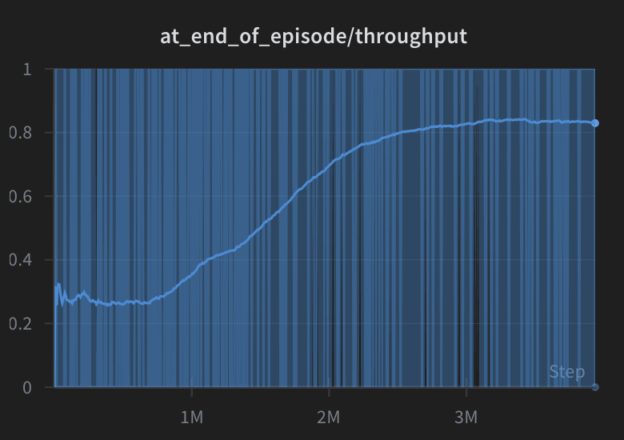
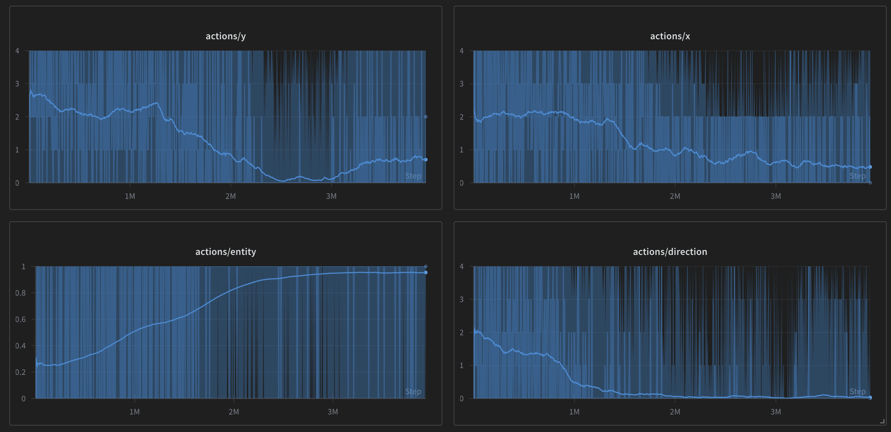

# Experiment Log

This document tracks experiments run against the Factorion RL agent, including
GPU benchmark results, architectural changes, and training curriculum
adjustments. All GPU benchmarks run 5 seeds at 100K timesteps on an NVIDIA A100
80GB PCIe and compare against the `main` branch using a two-sample t-test at
significance level 0.05.

## Table of Contents

- [Sweep 0r1udi17: 3M-step hyperparameter sweep](#sweep-0r1udi17-3m-step-hyperparameter-sweep)
- [PR #18: Delta-based reward shaping (PBRS)](#pr-18-delta-based-reward-shaping-pbrs)
- [PR #16: Spatial per-tile action prediction](#pr-16-spatial-per-tile-action-prediction)
- [PR #13: Eliminate difficulty-0 episodes](#pr-13-eliminate-difficulty-0-episodes)
- [PR #14: Re-enable early termination](#pr-14-re-enable-early-termination) (invalid benchmark)
- [PR #11: Scale max_steps dynamically](#pr-11-scale-max_steps-dynamically)
- [Historical logbook](#historical-logbook)

---

## Sweep 0r1udi17: 3M-step hyperparameter sweep

**Sweep:** [0r1udi17](https://wandb.ai/beyarkay/factorion/sweeps/0r1udi17)
| **PR:** [#29](https://github.com/beyarkay/factorion/pull/29)
| **Date:** 2026-03-06
| **Status:** Completed (CI timed out after 6h, but runs continued on W&B)

### Setup

First large-scale hyperparameter sweep after the major architectural changes (spatial
per-tile prediction, delta-based PBRS, entropy scheduling, torch.compile). Bayesian
optimization over 15 parameters, 3M timesteps per run, 19 runs completed (~1.8M steps
each before the CI SSH timeout killed the pod).

**Sweep config:** `run_cap=30`, Bayesian method, `curriculum/score` (maximize),
Hyperband early termination (`eta=3`, `min_iter=10`). Runs executed on a single
A100 80GB pod with 5 parallel agents via CUDA time-slicing.

### Results

6 of 19 runs reached curriculum level 4+. The best run (`n4ub5hsv`) reached
**level 5** with a score of 4.95 in only ~1.8M steps — the first time an 8×8
model has progressed this far in the curriculum.

| Run | Score | Level | Throughput | Steps | `ent_coef_start` | `coeff_throughput` | `coeff_shaping_dir` | `clip_coef` | `flat_dim` |
|-----|-------|-------|------------|-------|------------------|--------------------|---------------------|-------------|------------|
| **n4ub5hsv** | **4.95** | **5** | 0.926 | 1.8M | **0.015** | 0.630 | 3.77 | 0.300 | 64 |
| 58t4pbmb | 4.00 | 4 | 0.918 | 1.8M | 0.022 | 0.598 | 9.19 | 0.296 | 64 |
| 0gf51a4p | 3.96 | 4 | 0.928 | 1.8M | 0.028 | 0.680 | 1.30 | 0.280 | 256 |
| sr5brgmd | 3.96 | 4 | 0.930 | 1.7M | 0.026 | 0.846 | 0.74 | 0.344 | 128 |
| hp86918n | 3.95 | 4 | 0.866 | 1.8M | 0.044 | 0.793 | 0.64 | 0.342 | 128 |
| vl6gkxed | 3.95 | 4 | 0.852 | 1.8M | 0.013 | 0.505 | 1.32 | 0.187 | 128 |
| q4j1e6p7 | 1.95 | 2 | 0.726 | 1.8M | 0.060 | 0.815 | 6.43 | 0.255 | 64 |
| pvil1hnn | 1.95 | 2 | 0.888 | 1.8M | 0.034 | 0.684 | 2.01 | 0.175 | 64 |
| xbp22rx1 | 1.95 | 2 | 0.940 | 1.8M | 0.048 | 0.540 | 7.85 | 0.305 | 128 |
| ubhm2s5f | 1.95 | 2 | 0.584 | 2.1M | 0.069 | 0.678 | 7.43 | 0.231 | 128 |
| *9 runs* | 0.83–0.95 | 1 | 0.42–0.90 | 1.8–2.1M | 0.036–0.267 | 0.60–0.97 | 0.65–9.87 | 0.19–0.33 | 64–256 |

### Parameter importance (from W&B, descending)

1. **`ent_coef_start`** — by far the most important
2. `coeff_throughput`
3. `coeff_shaping_direction`
4. `clip_coef`
5. `coeff_shaping_location`
6. `tile_head_std`
7. `max_grad_norm`
8. `ent_coef_end`
9. `gamma`
10. `adam_epsilon`

### Key finding: `ent_coef_start` is critical

The clearest signal from the sweep: **low initial entropy is essential for
curriculum progression.**

| Group | Runs | Avg `ent_coef_start` |
|-------|------|----------------------|
| Level ≥ 4 | 6 | **0.025** |
| Level ≤ 1 | 9 | 0.116 |

Every run that reached level 4+ had `ent_coef_start < 0.045`. Every run stuck
at level 1 had `ent_coef_start > 0.035` (mostly 0.08–0.27).

**Why this matters:** The curriculum starts with difficulty-0 episodes where the
agent must learn "don't break what's already correct." High initial entropy
prevents the agent from exploiting this lesson — it keeps exploring randomly
instead of consolidating the "preserve the factory" behavior. Without that
foundation, it can never learn to fix things at higher difficulty levels.

This is consistent with the PR #13 finding that difficulty-0 episodes are
essential scaffolding. The entropy coefficient controls how quickly the agent
can internalize that scaffolding.

### Pattern analysis: top runs (level ≥ 4) vs bottom runs (level ≤ 1)

| Parameter | Top avg | Bottom avg | Signal |
|-----------|---------|------------|--------|
| `ent_coef_start` | 0.025 | 0.116 | **Top much lower** |
| `coeff_shaping_direction` | 2.8 | 4.3 | Top lower |
| `coeff_shaping_location` | 1.3 | 2.6 | Top lower |
| `coeff_shaping_entity` | 2.7 | 3.5 | Top lower |
| `tile_head_std` | 0.024 | 0.012 | Top higher |
| `adam_epsilon` | 4.3e-5 | 2.7e-5 | Top higher |
| `clip_coef` | 0.291 | 0.264 | ~similar |
| `learning_rate` | 4.5e-4 | 4.3e-4 | ~similar |
| `gamma` | 0.984 | 0.981 | ~similar |
| `flat_dim` | 128 | 149 | ~similar |
| `gae_lambda` | 0.853 | 0.866 | ~similar |
| `vf_coef` | 0.721 | 0.761 | ~similar |
| `max_grad_norm` | 1.717 | 1.868 | ~similar |

The shaping coefficients show a mild "less is more" pattern — moderate shaping
(1–3×) outperforms aggressive shaping (5–10×). This makes sense: PBRS deltas
are additive, so very large coefficients can dominate the throughput reward
signal and destabilize training.

### Best run config (`n4ub5hsv`)

```
ent_coef_start:           0.0151
ent_coef_end:             0.00161
coeff_throughput:         0.630
coeff_shaping_direction:  3.77
coeff_shaping_location:   1.28
coeff_shaping_entity:     0.72
clip_coef:                0.300
learning_rate:            0.000442
flat_dim:                 64
gamma:                    0.978
gae_lambda:               0.864
vf_coef:                  0.852
max_grad_norm:            0.560
adam_epsilon:              1.29e-5
tile_head_std:            0.012
```

### Range edge analysis

Several swept parameters had their best/top values clustered at the edge of
the search range, suggesting the range was too narrow:

| Parameter | Sweep range | Best value | Top runs near edge | Action |
|-----------|-------------|------------|-------------------|--------|
| `ent_coef_start` | [0.01, 0.3] | **0.015** | 6/6 near min | **Extend min to 0.005** — the most important parameter is pinned near the floor |
| `coeff_shaping_location` | [0.5, 10] | **1.28** | 6/6 near min | **Extend min to 0.1** — all top runs clustered in [0.68, 1.74] |
| `coeff_shaping_entity` | [0.5, 10] | **0.72** | 3/6 near min | **Extend min to 0.1** — best run nearly at floor |
| `coeff_shaping_direction` | [0.5, 10] | 3.77 | 4/6 near min | Keep — wide spread in top runs (0.6–9.2) |
| `max_grad_norm` | [0.5, 3.0] | **0.56** | best near min | **Extend min to 0.25** |
| `tile_head_std` | [0.001, 0.1] | 0.012 | 4/6 near min | Keep — min already at 0.001 |
| `adam_epsilon` | [1e-6, 2e-4] | 1.3e-5 | 4/6 near min | Keep — range is wide enough |
| `clip_coef` | [0.15, 0.35] | 0.30 | 2/6 near max | Keep — spread is reasonable |
| `vf_coef` | [0.5, 0.9] | 0.85 | best near max | Could extend max to 1.0 |

Parameters with no edge issues (values well within range): `learning_rate`,
`gamma`, `gae_lambda`, `coeff_throughput`, `ent_coef_end`, `flat_dim`.

### Infrastructure notes

- All runs show as "crashed" in W&B because the CI job's SSH connection to
  RunPod broke after ~6h (GitHub Actions timeout). The wandb agents were still
  running on the pod when it was terminated. This was fixed in a follow-up
  commit by adding SSH keepalive settings and a detached execution pattern
  (nohup + poll).
- The sweep used 5 parallel agents on a single A100 80GB pod. The model is
  small (~135K params), so 10 agents would have been feasible.
- Runs completed ~1.8M of the target 3M steps before termination. Despite
  this, the results are informative — the top runs had already plateaued at
  their curriculum level by ~1.5M steps.

---

## PR #18: Delta-based reward shaping (PBRS)

**Branch:** `claude/reward-shaping-tile-match`
| **PR:** [#18](https://github.com/beyarkay/factorion/pull/18)
| **Status:** In progress (awaiting benchmark)

### What changed

Replaced absolute tile-match reward components with delta-based potential-based
reward shaping (Ng et al. 1999). The previous decomposed tile-match approach
(`coeff_tile_match_location/entity/direction`) had two design flaws:

1. **Drowned signal**: Metrics were computed over all 64 tiles, but only ~6 have
   entities in the solution. The baseline similarity was ~0.91–0.98, so a correct
   placement improved the metric by just ~1/64 ≈ 0.016 — lost in noise.

2. **"Do nothing" is rewarded**: Absolute similarity meant the initial state
   (already near-complete) scored ~0.95+. Over 16 steps a passive agent
   accumulated ~15.2 in shaped reward, making the marginal gain from actually
   solving negligible.

The fix keeps the decomposed structure (one signal per action head) but makes two
changes:

- **Focus**: All three metrics (`location_match`, `entity_match`,
  `direction_match`) are computed over solution-nonempty tiles only (~6 tiles
  instead of 64) — ~10x stronger per-placement signal.
- **Delta-based**: The reward is the *change* in similarity per step, not the
  absolute value. This eliminates free reward for doing nothing (all deltas = 0
  for no-ops).

The shaped reward is added outside the normalized weighted sum (additive PBRS),
which is theoretically guaranteed not to alter the optimal policy:

```
reward += coeff_shaping_location  * (location_match(s') - location_match(s))
        + coeff_shaping_entity    * (entity_match(s')   - entity_match(s))
        + coeff_shaping_direction * (direction_match(s') - direction_match(s))
```

Key properties:
- Do nothing → all deltas = 0 (no free reward)
- Correct placement at right spot → location delta ~ +1/6 ≈ +0.17
- Correct entity type → entity delta ~ +1/6 ≈ +0.17
- Correct direction → direction delta ~ +1/6 ≈ +0.17
- Each action head gets its own gradient signal

### Benchmark results

*Awaiting GPU benchmark run.*

### Previous attempt: Absolute tile-match (PR #18 v1)

The first version of this PR used absolute tile-match values as reward
components in the normalized weighted sum. Benchmark results showed no
significant improvement:

| Metric | main (n=10) | PR (n=10) | Change | p-value | Verdict |
|--------|-------------|-----------|--------|---------|---------|
| Throughput (moving avg) | 0.5936 +/- 0.0769 | 0.5772 +/- 0.0670 | -2.8% | 0.560 | No significant difference |
| Training speed (SPS) | 251 +/- 5 | 205 +/- 2 | **-18.3%** | 2.6e-10 | **Significantly worse** |

The absolute approach was both slower (extra computation for no benefit) and
unable to provide a useful learning signal due to the drowned signal and
do-nothing reward problems described above.

---

## PR #16: Spatial per-tile action prediction

**Branch:** `claude/review-curriculum-learning-dgOgO`
| **PR:** [#16](https://github.com/beyarkay/factorion/pull/16)
| **Status:** Merged

### What changed

Replaced the independent x and y linear action heads with a single spatial
tile-selection head. The old architecture sampled x and y coordinates
independently (two separate linear layers consuming flattened features), which
meant the model couldn't express joint spatial preferences. The new architecture
uses a 1x1 convolution over the encoder output to produce one logit per tile,
sampling (x, y) jointly. Entity and direction predictions are then conditioned
on the feature vector at the selected tile.

Key structural changes:
- **Removed:** `action_head` (large `flat_dim -> flat_dim` linear), `x_head`, `y_head`
- **Added:** `tile_logits` (1x1 Conv2d, 65 params), `ent_head` and `dir_head` now take per-tile features (chan3 dims) instead of flattened global features
- **Parameter reduction:** ~2.6M -> 520 parameters in the action pathway (~5000x fewer)
- **New hyperparameter:** `tile_head_std` controls initialization scale of tile selection (smaller = more uniform initial exploration)

### Benchmark results (5 seeds, 100K timesteps, 8x8 grid)

| Metric | main (n=5) | PR (n=5) | Change | p-value | Verdict |
|--------|------------|----------|--------|---------|---------|
| Throughput (moving avg) | 0.5808 +/- 0.0897 | 0.6000 +/- 0.0588 | +3.3% | 0.701 | No significant difference |
| Curriculum level | 1.0 +/- 0.0 | 1.0 +/- 0.0 | +0.0% | 1.000 | No significant difference |
| Training speed (SPS) | 122 +/- 1 | 215 +/- 3 | **+76.4%** | 4.7e-09 | **Significantly better** |

Per-seed throughput:

| Seed | Baseline | PR |
|------|----------|-----|
| 1 | 0.6600 | 0.6380 |
| 2 | 0.4960 | 0.6140 |
| 3 | 0.5620 | 0.6240 |
| 4 | 0.4980 | 0.4960 |
| 5 | 0.6880 | 0.6280 |

W&B runs: [PR seeds](https://wandb.ai/beyarkay/factorion/runs/q32bonut), [Baseline seeds](https://wandb.ai/beyarkay/factorion/runs/71c628ca) (see [PR comment](https://github.com/beyarkay/factorion/pull/16#issuecomment-3954571547) for all links)

### Analysis

The 76% training speed improvement is the clear win here — the massive parameter
reduction (2.6M -> 520 in the action pathway) directly translates to faster
forward/backward passes. Throughput showed a slight +3.3% improvement but was
not statistically significant (p=0.701).

Both architectures plateau at curriculum level 1 with ~0.58-0.60 throughput
within 100K steps. The ~0.58 average means the agent is solving roughly 16% of
the non-trivial episodes (those with `num_missing_entities=1`) — barely above
the random baseline.

**Why no throughput difference?** The architecture change addressed
*representational capacity* (can the model express joint spatial preferences?)
but the binding constraint is *exploration* (can the model discover good actions
at all?). Both architectures stumble into the correct action at the same low
rate, so they plateau at the same throughput.

The old architecture randomly gets the right answer ~1/640 of the time per step
(1/64 tiles x 1/2 entities x 1/5 directions). The new architecture also starts
at ~1/640 — even though tile selection is joint, it's initialized near-uniform,
so the initial probability of picking the right tile is still 1/64. The
conditioning only helps *after* the model has started learning which tiles are
interesting, but it can't learn that without reward signal.

The model learns a strong "do nothing" prior from `num_missing_entities=0`
episodes (where throughput=1.0 every step), and when it faces
`num_missing_entities=1`, that same "do nothing" strategy yields throughput=0.0.
The binary reward provides no gradient to bridge the gap. At 100K timesteps with
16 envs and `max_steps=16`, there are roughly 800 episodes with
`num_missing_entities=1`, yielding approximately 20 accidental successes —
nowhere near enough positive gradient signals to overcome thousands of "do
nothing" updates. More training steps (e.g. 1M) would increase this to ~200, but
likely still not enough for a breakthrough.

See also [PR #13](#pr-13-eliminate-difficulty-0-episodes) for evidence that the
difficulty-0 episodes are essential scaffolding, not free wins.

---

## PR #13: Eliminate difficulty-0 episodes

**Branch:** `claude/remove-difficulty-zero-episodes-IstUO`
| **PR:** [#13](https://github.com/beyarkay/factorion/pull/13)
| **Status:** Closed (significantly worse)

### What changed

Changed `num_missing_entities` sampling from `randint(0, max+1)` to
`randint(1, max+1)` so every training episode requires the agent to actually
place entities. The hypothesis was that difficulty-0 episodes (factory already
complete) were "free wins" inflating the throughput average.

### Why it failed

Difficulty-0 episodes are **not** free wins. The agent must learn to *not
destroy* the existing factory — placing a belt on top of an existing correct belt
breaks the factory. These episodes teach the crucial prerequisite skill of "don't
break things." Without this foundation, the agent cannot learn anything at all.

### Benchmark results (5 seeds, 100K timesteps, 8x8 grid)

| Metric | main (n=5) | PR (n=5) | Change | p-value | Verdict |
|--------|------------|----------|--------|---------|---------|
| Throughput (moving avg) | 0.5808 +/- 0.0897 | 0.0128 +/- 0.0286 | **-97.8%** | 5.3e-05 | **Significantly worse** |
| Curriculum level | 1.0 +/- 0.0 | 1.0 +/- 0.0 | +0.0% | 1.000 | No significant difference |
| Training speed (SPS) | 122 +/- 1 | 122 +/- 2 | +0.2% | 0.850 | No significant difference |

Per-seed throughput:

| Seed | Baseline | PR |
|------|----------|-----|
| 1 | 0.6600 | 0.0000 |
| 2 | 0.4960 | 0.0000 |
| 3 | 0.5620 | 0.0000 |
| 4 | 0.4980 | 0.0640 |
| 5 | 0.6880 | 0.0000 |

W&B runs: see [PR comment](https://github.com/beyarkay/factorion/pull/13#issuecomment-3949807376) for all links.

### Key takeaway

The curriculum's difficulty-0 episodes serve as essential scaffolding. The agent
needs to first learn "preserve what's already correct" before it can learn "fix
what's broken." Removing this scaffolding causes catastrophic failure — the agent
achieves near-zero throughput across all seeds.

This reveals a tension in the curriculum design: difficulty-0 episodes teach the
agent a strong "do nothing" prior (throughput=1.0 for every step where the agent
doesn't break anything). This is a necessary prerequisite skill, but it then
*conflicts* with difficulty-1 episodes where "do nothing" yields throughput=0.0.
The binary reward provides no gradient to bridge from "don't break things" to
"fix things." The mix of difficulty levels isn't just about avoiding sparse
rewards — it's about teaching prerequisite skills that the agent must then learn
to selectively override.

---

## PR #14: Re-enable early termination

**Branch:** `claude/re-enable-early-termination-LtBtP`
| **PR:** [#14](https://github.com/beyarkay/factorion/pull/14)
| **Status:** Open

### What changed

Re-enabled early episode termination when the agent solves the puzzle (achieves
throughput=1.0), awarding a completion bonus.

### Benchmark results (invalid)

The benchmark for this PR was run before the CI fix in
[PR #15](https://github.com/beyarkay/factorion/pull/15), which fixed a bug
where the benchmark was comparing the PR branch against itself instead of
against `main`. The per-seed values are identical between baseline and PR,
confirming the comparison is invalid. This PR needs to be re-benchmarked.

Reported (invalid) results for reference:

| Metric | main (n=5) | PR (n=5) | Change | Verdict |
|--------|------------|----------|--------|---------|
| Throughput | 0.8224 +/- 0.1065 | 0.8224 +/- 0.1065 | +0.0% | Invalid (same data) |

---

## PR #11: Scale max_steps dynamically

**Branch:** `claude/scale-episode-difficulty-69JOP`
| **PR:** [#11](https://github.com/beyarkay/factorion/pull/11)
| **Status:** Open

### What changed

Scaled `max_steps` (the number of actions per episode) based on
`num_missing_entities` rather than using a fixed value. The idea was to reduce
wasted steps when only a few entities need to be placed.

### Benchmark results (5 seeds, 100K timesteps, 8x8 grid)

| Metric | main (n=5) | PR (n=5) | Change | p-value | Verdict |
|--------|------------|----------|--------|---------|---------|
| Throughput (moving avg) | 0.5876 +/- 0.1149 | 0.5332 +/- 0.0402 | -9.3% | 0.364 | No significant difference |
| Curriculum level | 1.0 +/- 0.0 | 1.0 +/- 0.0 | +0.0% | 1.000 | No significant difference |
| Training speed (SPS) | 281 +/- 1 | 252 +/- 7 | **-10.5%** | 6.0e-04 | **Significantly worse** |

Per-seed throughput:

| Seed | Baseline | PR |
|------|----------|-----|
| 1 | 0.6900 | 0.5220 |
| 2 | 0.4980 | 0.5060 |
| 3 | 0.6860 | 0.5380 |
| 4 | 0.4360 | 0.5000 |
| 5 | 0.6280 | 0.6000 |

W&B runs: see [PR comment](https://github.com/beyarkay/factorion/pull/11#issuecomment-3954817197) for all links.

### Analysis

No throughput improvement (-9.3%, not significant) and a statistically
significant 10.5% slowdown in training speed. The dynamic step scaling adds
computational overhead without helping the agent learn faster.

One minor observation: the PR has notably lower throughput variance (0.0402 vs
0.1149), suggesting the dynamic step count may have a regularizing effect. But
this doesn't translate to better performance.

Note: Earlier benchmarks for this PR were invalid (run before the CI fix in
[PR #15](https://github.com/beyarkay/factorion/pull/15)). The results above are
from the corrected benchmark pipeline.

---

## Historical logbook

These are older experiments from before the GPU benchmark CI was set up. Metrics
were tracked via Weights & Biases.

### 5x5 world, 150K timesteps, pre-built factory (2025-10)

Git hash: `0fb32039` | [W&B run](https://wandb.ai/beyarkay/factorion/runs/z5v42zmk)

The model was given a perfect factory and had to learn not to destroy it.
Throughput was stagnant at ~0.25 until around 850K global steps, then started
improving. The model learned to place a transport belt without a direction as a
no-op — this never damages the map, whereas placing an empty entity might remove
existing belts.




### 5x5 world, struggling past 0.4 throughput (2025-11-05)

[W&B run](https://wandb.ai/beyarkay/factorion/runs/moiiqkew)

With fully random factory layouts, the model maxed out at 0.42 throughput on a
5x5 world even after 10 hours. Possible causes: entropy coefficient too low
(lack of exploration) or learning rate decaying too fast (stuck in local minima).

### Lack of randomisation caused inflated results (2025-11-04)

Commit `7d13160` significantly reduced the entropy of the initial factory layout,
making the task much easier (only one factory layout to memorize). Results were
inflated. Reverted in `6bd587b`.

### Sweep for 7x7 model (2025-11-03)

[W&B sweep](https://wandb.ai/beyarkay/factorion/sweeps/ouwt11gi)

Long-running hyperparameter sweep for 7x7 training. Early-stopping calculations
were incorrect, leading to no runs stopping early and wasted compute. One
promising run: [blmu29sm](https://wandb.ai/beyarkay/factorion/sweeps/ouwt11gi/runs/blmu29sm).

### Training 7x7 model (2025-10-31)

[W&B run](https://wandb.ai/beyarkay/factorion/runs/nikxsaj6)

The model learned but never got past ~0.8 throughput, so it never saw more than
1 entity missing.

### Sweep for speed (2025-10-30)

[W&B sweep](https://wandb.ai/beyarkay/factorion/sweeps/6zvjlntl)

Hyperparameter sweep focused on training speed.

### Model size comparison on 6x6 (2025-10-29)

Compared 32-32-32-128 (`ymhimm2c`) vs 48-48-48-256 (`r6p0mc0y`). The larger
model learned faster and reached 8 entities removed (vs 6 for the smaller
model).

### 5x5 full curriculum completion (2025-10-28)

[W&B run](https://wandb.ai/beyarkay/factorion/runs/wmgng3jl)

This run took ~6.5M global steps to pass 0.5 throughput, but at 12M steps it had
figured out how to get >0.9 throughput with every entity missing. This
demonstrates the agent can fully solve the 5x5 curriculum given enough training
time.
