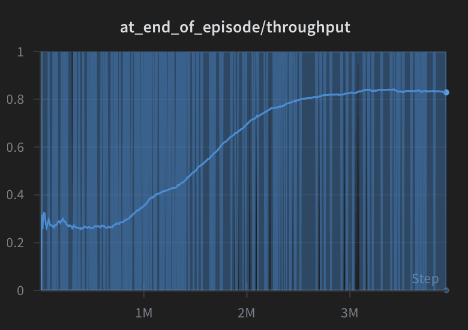
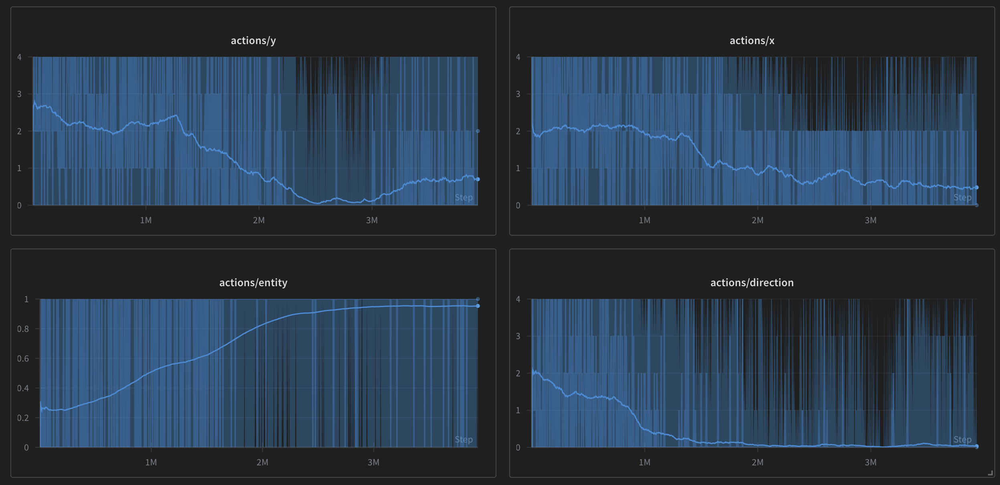

# Experiment Log

This document tracks experiments run against the Factorion RL agent, including
GPU benchmark results, architectural changes, and training curriculum
adjustments. All GPU benchmarks run 5 seeds at 100K timesteps on an NVIDIA A100
80GB PCIe and compare against the `main` branch using a two-sample t-test at
significance level 0.05.

## Experiment index

One line per PR, all ~360 of them, so an idea can be checked against what has already been tried before it is proposed again. Follow the link for the compare report and discussion. **Search this before suggesting an experiment.**

✅ merged and kept · ❌ closed: worse, null, or abandoned · ↩️ reverted · ⏭️ superseded by another PR · ⏳ open · ➖ merged, no measurable effect

### Settled — don't re-propose without new evidence

- **Conv trunk**: one 3×3 layer is best ([#445](https://github.com/beyarkay/factorion/pull/445)); deeper adds nothing, kernel 1 is worse ([#449](https://github.com/beyarkay/factorion/pull/449)), kernel 5 never produced a good run ([#314](https://github.com/beyarkay/factorion/pull/314)). Attention over conv tokens carries long-range structure ([#314](https://github.com/beyarkay/factorion/pull/314)); a pure transformer lost to the CNN ([#48](https://github.com/beyarkay/factorion/pull/48)).
- **Positional / global context**: CoordConv ([#441](https://github.com/beyarkay/factorion/pull/441)) and the pooled global vector ([#443](https://github.com/beyarkay/factorion/pull/443)) were removed as redundant with attention + learned positional embedding.
- **Demo order**: fixed entity-type order (assemblers → inserters → belts) was worse; the model can't recover from a wrong order ([#452](https://github.com/beyarkay/factorion/pull/452)). Demos stay in random order.
- **SFT mixture**: lesson weighting ([#414](https://github.com/beyarkay/factorion/pull/414), [#417](https://github.com/beyarkay/factorion/pull/417)) and missing-fraction weighting ([#329](https://github.com/beyarkay/factorion/pull/329)) did not help; pairs are balanced per lesson by pair count ([#226](https://github.com/beyarkay/factorion/pull/226)). Holding MEMORISE out hurt ([#457](https://github.com/beyarkay/factorion/pull/457)).
- **Loss tricks**: gating the item loss on entity ([#112](https://github.com/beyarkay/factorion/pull/112)) and recipe-only MEMORISE loss ([#435](https://github.com/beyarkay/factorion/pull/435)) both broke the item head.
- **RL reward shaping**: gap-closing / almost-connected shaping ([#353](https://github.com/beyarkay/factorion/pull/353), [#370](https://github.com/beyarkay/factorion/pull/370)), per-entity-flow fallback ([#391](https://github.com/beyarkay/factorion/pull/391)), power-compressed trial reward ([#401](https://github.com/beyarkay/factorion/pull/401), [#403](https://github.com/beyarkay/factorion/pull/403)) all failed. What works: improvement-over-reset ([#398](https://github.com/beyarkay/factorion/pull/398)), dense per-step delta ([#405](https://github.com/beyarkay/factorion/pull/405)), γ = 0.997 ([#400](https://github.com/beyarkay/factorion/pull/400)).
- **RL for trials**: self-imitation ([#376](https://github.com/beyarkay/factorion/pull/376), [#377](https://github.com/beyarkay/factorion/pull/377)), dropping EOT from the entropy bonus ([#373](https://github.com/beyarkay/factorion/pull/373)), excluding deep trials ([#375](https://github.com/beyarkay/factorion/pull/375)), PPO on trials only ([#436](https://github.com/beyarkay/factorion/pull/436)), an edge-marker bridge lesson ([#378](https://github.com/beyarkay/factorion/pull/378)) — all neutral or worse on `eval/trial_thput`.
- **Legal-tile mask in PPO**: only works when applied identically at sampling *and* update ([#413](https://github.com/beyarkay/factorion/pull/413)); sampling-only versions were worse ([#243](https://github.com/beyarkay/factorion/pull/243), [#340](https://github.com/beyarkay/factorion/pull/340)).
- **PPO hparam sweeps**: folding sweep consensus into defaults gave no significant gain ([#338](https://github.com/beyarkay/factorion/pull/338), [#346](https://github.com/beyarkay/factorion/pull/346), [#363](https://github.com/beyarkay/factorion/pull/363)).

### Architecture

| PR | | Experiment → result |
|---|---|---|
| [#16](https://github.com/beyarkay/factorion/pull/16) | ✅ | AgentCNN spatial per-tile action head (1x1 conv tile logits, entity/dir from tile feature); 75% faster, thput +3.3% n.s. |
| [#25](https://github.com/beyarkay/factorion/pull/25) | ❌ | Action masking of source/sink tiles and entity-specific directions; level +23% (p=0.037), score n.s. (p=0.076); closed unmerged |
| [#48](https://github.com/beyarkay/factorion/pull/48) | ❌ | ViT-style AgentTransformer vs CNN: -60% curriculum score at 100k steps (p<1e-6); after sweep tops ~0.94, below 0.95 level-up |
| [#96](https://github.com/beyarkay/factorion/pull/96) | ✅ | AgentCNN gains item and misc heads so policy can place UG belts and assemblers; SFT supervises ITEMS+MISC; smoke val acc ~0.79 |
| [#103](https://github.com/beyarkay/factorion/pull/103) | ✅ | Add binary EOT head trained in SFT (terminal pair eot=1, pos_weight BCE, placement loss masked on terminal) |
| [#140](https://github.com/beyarkay/factorion/pull/140) | ⏭️ | Sweepable CNN depth/width mega-branch; sweep ui3v0gn8 best val/throughput 0.265; split into #146,#144,#145,#147,#149,#148,#153,#155/156,#157 |
| [#146](https://github.com/beyarkay/factorion/pull/146) | ✅ | AgentCNN variable-depth encoder via layer1..8 widths + kernel_size (same padding) |
| [#149](https://github.com/beyarkay/factorion/pull/149) | ✅ | Plumb dropout knob (Dropout2d) from SFTArgs into the encoder, default 0 |
| [#245](https://github.com/beyarkay/factorion/pull/245) | ✅ | Encode nominal obs channels categorically (embeddings for entity/item, one-hots for direction/misc): significantly better than main |
| [#281](https://github.com/beyarkay/factorion/pull/281) | ❌ | PoC masked-tile MLM encoder pretrained on 59.7k human blueprints (#160); standalone, closed unmerged |
| [#287](https://github.com/beyarkay/factorion/pull/287) | ⏭️ | H1 kill-test: global-context feature on MEMORISE_2-only SFT (val/thput_eot 0.94); superseded by #289/#290 stack |
| [#290](https://github.com/beyarkay/factorion/pull/290) | ✅ | Global-context feature (pooled mean+max, dim 32) into per-tile heads: MEMORISE_2 val/thput_eot 0.054 -> 0.985; 20M mixed 0.347 -> 0.766 |
| [#313](https://github.com/beyarkay/factorion/pull/313) | ⏭️ | Sweepable global-knowledge arch knobs (global_feat_dim, broadcast, etc.); sweep favoured attention+CoordConv+pooled global (thput_eot 0.85 vs 0.51); superseded by #314 |
| [#314](https://github.com/beyarkay/factorion/pull/314) | ✅ | Self-attention stage over conv features (residual, 11x11 tokens) plus CoordConv and pooled global vector; SFT compare val/thput_eot 0.564->0.711 (+0.147, p=0.011) |
| [#320](https://github.com/beyarkay/factorion/pull/320) | ✅ | Unify four duplicated action samplers into one AgentCNN.sample_action (train, rollout, mod server, web UI); 1M-sample compare showed no clear change |
| [#326](https://github.com/beyarkay/factorion/pull/326) | ✅ | Make EOT action skip placement (EOT step no longer places an entity) |
| [#327](https://github.com/beyarkay/factorion/pull/327) | ✅ | Mask invalid action combos (direction/item/misc conditioned on entity); SFT ~same, 50M-step PPO compare ~zero difference, maybe slight gain |
| [#392](https://github.com/beyarkay/factorion/pull/392) | ❌ | Per-entity flow as sixth observation channel for encoder/critic; SFT 5M val/thput 0.851; closed, no verdict in digest |
| [#437](https://github.com/beyarkay/factorion/pull/437) | ⏭️ | Shrink conv trunk to one 3x3 layer; superseded by claude/arch-one-conv-layer branch (#440/#445) |
| [#438](https://github.com/beyarkay/factorion/pull/438) | ⏭️ | Drop CoordConv channels; superseded by same change on clearer branch (#441) |
| [#441](https://github.com/beyarkay/factorion/pull/441) | ✅ | Drop CoordConv coordinate channels (learned pos embed carries attention): 5M x3 val/thput +0.027 (p=0.43), neutral-to-better |
| [#442](https://github.com/beyarkay/factorion/pull/442) | ✅ | Critic and EOT heads read mean-pooled map via Linear(C,1) instead of flatten; params 15.5k->129; PPO run higher thput than main |
| [#443](https://github.com/beyarkay/factorion/pull/443) | ✅ | Remove pooled global-context vector; 5M x3 val/thput 0.516 vs 0.531 (-0.015, p=0.06), within +-0.02 tolerance |
| [#445](https://github.com/beyarkay/factorion/pull/445) | ✅ | Shrink conv trunk to one 3x3 layer (326k->37k params): 5M x3 val/thput +0.040 (p=0.044), CROSS -0.32, recipe lessons up |
| [#446](https://github.com/beyarkay/factorion/pull/446) | ✅ | Attention out_proj init std 0.1 instead of 0 so Q/K/V get gradient at step 0; 5M val +0.014 (1 seed) |
| [#449](https://github.com/beyarkay/factorion/pull/449) | ❌ | Drop spatial mixing from conv tokenizer (kernel 1): 20M val/thput 0.800 vs 0.831; 3x3 conv is critical |
| [#455](https://github.com/beyarkay/factorion/pull/455) | ⏭️ | Replace EOT head with raw items/s throughput regression and caller-controlled stop target; replaced by #456/#458 |
| [#456](https://github.com/beyarkay/factorion/pull/456) | ⏭️ | Replace EOT with throughput regression head; superseded by leaner #458 |
| [#458](https://github.com/beyarkay/factorion/pull/458) | ⏳ | Replace EOT head with throughput-prediction head (log1p MSE), stop when predicted thput >= target; minimal rebuild of #456 |

### SFT recipe

| PR | | Experiment → result |
|---|---|---|
| [#47](https://github.com/beyarkay/factorion/pull/47) | ✅ | Add SFT pretraining pipeline (multi-head CE on expert demos) plus CI jobs; smoke val acc 0.908->0.937 at 100k samples |
| [#77](https://github.com/beyarkay/factorion/pull/77) | ✅ | Empty-commit SFT smoke test of merged pipeline on GPU CI; val acc ~0.98 at 100k samples/30 epochs |
| [#81](https://github.com/beyarkay/factorion/pull/81) | ✅ | Stop FOOTPRINT leaking placement set in lessons (tile acc was ~98% via leak); smoke val acc drops to ~0.88, honest signal |
| [#102](https://github.com/beyarkay/factorion/pull/102) | ✅ | SFT smoketest 100k->300k samples, grid 8->11: val acc 0.79->0.90 at smoke |
| [#104](https://github.com/beyarkay/factorion/pull/104) | ✅ | SFT W&B sweep (cosine LR, AdamW, grad clip, per-head loss weights, widths) on val/acc; best 0.9010 and 0.9153 in two sweeps |
| [#112](https://github.com/beyarkay/factorion/pull/112) | ❌ | Gate item-head loss on entity-needs-item: broke val/item_acc globally (0.992->0.001); fix via more recipe lessons instead |
| [#114](https://github.com/beyarkay/factorion/pull/114) | ❌ | Scale SFT smoketest 300k->3M samples as long-run test; never meant to merge (best val acc 0.8836, 2h16m) |
| [#151](https://github.com/beyarkay/factorion/pull/151) | ⏭️ | Adopt sweep #3 winner (layers 93/69/96, lr 3.24e-3, dropout 0.18, wd 1.66e-3; val/throughput 0.265) as default; duplicated by #157 |
| [#157](https://github.com/beyarkay/factorion/pull/157) | ✅ | Adopt sweep run kkcv6xe3 (val thput 0.335) as canonical default: size 11, 1M samples, 45 epochs, layers 93/69/96, lr 3.24e-3, dropout 0.18 |
| [#215](https://github.com/beyarkay/factorion/pull/215) | ⏭️ | Wide SFT sweep on val/thput_eot (fix invalid chan args): 85 runs, best 0.3511; results applied via #242 which was also closed |
| [#220](https://github.com/beyarkay/factorion/pull/220) | ✅ | Drop pos_weight (~15) from SFT EOT BCE loss: it made EOT fire at ~6% prob, explaining thput_eot 0.11 vs thput 0.335 |
| [#225](https://github.com/beyarkay/factorion/pull/225) | ✅ | Rebalance SFT eval budget: val_frac 0.1->0.05, eval_rollouts_max_seeds 100->400 to lower throughput-metric noise |
| [#226](https://github.com/beyarkay/factorion/pull/226) | ✅ | Balance SFT dataset by (state,action) pair count per lesson (fewest-first) not lesson count, to stop belt-heavy lessons starving item/entity heads |
| [#238](https://github.com/beyarkay/factorion/pull/238) | ✅ | Eval/checkpoint cadence by sample count (eval_every_n_samples=1M) instead of per-epoch; smoke val/thput_eot 0.171 |
| [#242](https://github.com/beyarkay/factorion/pull/242) | ❌ | Apply best sweep o47ig39g SFT hparams (lr 3.4e-4, bs128, smaller layers); closed since current defaults already gave a great run |
| [#288](https://github.com/beyarkay/factorion/pull/288) | ✅ | Add --start-from to sft.py to resume SFT from checkpoint or W&B run id |
| [#289](https://github.com/beyarkay/factorion/pull/289) | ⏭️ | Base of stack: SFT on MEMORISE_2 only as control for global-context test; replaced by #290 compare |
| [#300](https://github.com/beyarkay/factorion/pull/300) | ❌ | Throwaway [single-lesson] SFT on MOVE_ONE_ITEM only to check achievable throughput ceiling; bulk-closed, not for merge |
| [#301](https://github.com/beyarkay/factorion/pull/301) | ❌ | Throwaway [single-lesson] SFT on SPLITTER_SPLIT only to check achievable throughput ceiling; bulk-closed |
| [#302](https://github.com/beyarkay/factorion/pull/302) | ❌ | Throwaway [single-lesson] SFT on SPLITTER_MERGE only to check achievable throughput ceiling; bulk-closed |
| [#303](https://github.com/beyarkay/factorion/pull/303) | ❌ | Throwaway [single-lesson] SFT on MOVE_VIA_UG_BELT only to check achievable throughput ceiling; bulk-closed |
| [#304](https://github.com/beyarkay/factorion/pull/304) | ❌ | Throwaway [single-lesson] SFT on MEMORISE_1_INGREDIENT_RECIPES only to check ceiling; bulk-closed |
| [#305](https://github.com/beyarkay/factorion/pull/305) | ❌ | Throwaway [single-lesson] SFT on MEMORISE_2_INGREDIENT_RECIPES only to check ceiling; bulk-closed |
| [#306](https://github.com/beyarkay/factorion/pull/306) | ❌ | Throwaway [single-lesson] SFT on MEMORISE_3_INGREDIENT_RECIPES only to check ceiling; bulk-closed |
| [#307](https://github.com/beyarkay/factorion/pull/307) | ❌ | Throwaway [single-lesson] SFT on MEMORISE_4_INGREDIENT_RECIPES only to check ceiling; bulk-closed |
| [#308](https://github.com/beyarkay/factorion/pull/308) | ❌ | Throwaway [single-lesson] SFT on MOVE_ONE_ITEM_CHAOS only to check achievable throughput ceiling; bulk-closed |
| [#309](https://github.com/beyarkay/factorion/pull/309) | ❌ | Throwaway [single-lesson] SFT on CROSS_UNDER_BELT only to check achievable throughput ceiling; bulk-closed |
| [#310](https://github.com/beyarkay/factorion/pull/310) | ❌ | Throwaway [single-lesson] SFT on FACTORY_1_INGREDIENT only to check achievable throughput ceiling; bulk-closed |
| [#319](https://github.com/beyarkay/factorion/pull/319) | ✅ | Lower SFT lr default 3.242e-3 -> 1e-3 (stale from conv-only sweep; attention arch swept 8e-4..3e-3); compare val/thput_eot 0.745->0.876 (+0.13, p=0.12, n=3) |
| [#329](https://github.com/beyarkay/factorion/pull/329) | ❌ | Weight SFT samples by missing fraction (missing_fraction_alpha); no effect good or bad (sweep best val/thput 0.83) |
| [#422](https://github.com/beyarkay/factorion/pull/422) | ✅ | Warmup-Stable-Decay LR schedule for SFT so budgets are comparable; 10M compare val/thput +0.008 (p=0.27, neutral) |
| [#435](https://github.com/beyarkay/factorion/pull/435) | ❌ | MEMORISE trained on recipe selection only (item head loss): val/thput 0.081 vs 0.496 (p=0.002), FACTORY/MEMORISE ~0 |
| [#452](https://github.com/beyarkay/factorion/pull/452) | ❌ | Order SFT demos assemblers>inserters>belts>UG: val -0.032, FACTORY_1 +0.14 but MEMORISE worse; can't recover from wrong order |
| [#467](https://github.com/beyarkay/factorion/pull/467) | ⏳ | Inject random entity errors into SFT trajectories (prob 0.03) with overwrite-fix labels to train repair; stacked on #466 |

### PPO / RL

| PR | | Experiment → result |
|---|---|---|
| [#19](https://github.com/beyarkay/factorion/pull/19) | ✅ | Anneal entropy coef linearly 0.05->0.0005 (was fixed 0.00065); 10-seed thput +9.8% (p=0.002) |
| [#29](https://github.com/beyarkay/factorion/pull/29) | ❌ | Rework sweep.yaml for 5M-step runs focusing on shaping coefs/entropy schedule; sweep produced no results; closed unmerged |
| [#141](https://github.com/beyarkay/factorion/pull/141) | ✅ | Add no-op-default dropout and weight-decay args to PPO/AgentCNN |
| [#166](https://github.com/beyarkay/factorion/pull/166) | ✅ | RL fine-tuning from SFT ckpt: full-blank task, throughput-dominant reward (no PBRS), critic warm-up, kkcv6xe3 arch defaults |
| [#188](https://github.com/beyarkay/factorion/pull/188) | ❌ | RL-finetune sweep targeting SFT-policy collapse (eot_rate->1, eval thput 0.11->0.05); best rollout/reward 0.09-0.126; closed unmerged |
| [#193](https://github.com/beyarkay/factorion/pull/193) | ✅ | Fix PPO training on fixed ~num_envs factories (fixed seed + autoreset clobber): rollout memorized to 1.0 while eval fell to ~0.04 |
| [#243](https://github.com/beyarkay/factorion/pull/243) | ❌ | Mask illegal tiles in PPO tile head: rollout/thput 0.5068 vs 0.5087 (p=0.93), invalid_frac down, but frac_reachable dropped and rollouts slower |
| [#260](https://github.com/beyarkay/factorion/pull/260) | ➖ | Focused grid sweep of step_penalty [0..0.01] from SFT base uju9n8ql to rescue EOT-head collapse; sweep best rollout/thput 0.6185 |
| [#283](https://github.com/beyarkay/factorion/pull/283) | ❌ | Add Dr. GRPO critic-free RL finetuner (grpo.py); closed unmerged |
| [#337](https://github.com/beyarkay/factorion/pull/337) | ✅ | Fix attention stack ignoring --dropout (default 0.1 TransformerEncoder dropout made approx_kl nonzero with frozen actor); rollout/thput 0.51->0.71 |
| [#338](https://github.com/beyarkay/factorion/pull/338) | ❌ | Broaden PPO sweep to update-loop knobs unblocked by #337; sweep llfgwhki best eval/thput 0.807 over 26 runs, closed unmerged (later folded via #346) |
| [#340](https://github.com/beyarkay/factorion/pull/340) | ❌ | Try legal_mask=True in PPO sampling; 1.5M compare rollout/thput 0.799 -> 0.712 (-0.087), invalid_frac near zero |
| [#341](https://github.com/beyarkay/factorion/pull/341) | ✅ | Keep legal-tile mask sampleable when nothing buildable (fix pushed onto #340 branch) |
| [#346](https://github.com/beyarkay/factorion/pull/346) | ❌ | Fold sweep llfgwhki consensus into PPO defaults (gamma, gae_lambda...); 2.5M compare eval/thput 0.776->0.784 (+0.008, p=0.38), no significant gain |
| [#352](https://github.com/beyarkay/factorion/pull/352) | ❌ | PPO gamma = 1.0 via training_config; no thput gain (0.780->0.785), FACTORY_1_INGREDIENT worse, ep length 10.9->26.9 since nothing penalises long zero-thput builds |
| [#363](https://github.com/beyarkay/factorion/pull/363) | ❌ | Sweep gamma on rollout/thput: best 0.9974 -> 0.788 but 0.96 gave 0.779; judged luck, existing 0.9566 kept |
| [#364](https://github.com/beyarkay/factorion/pull/364) | ⏳ | Zero EOT head entropy bonus (--ent-mult-eot 0) plus instrumentation, optional per-head entropy normalisation; compares produced no runs |
| [#365](https://github.com/beyarkay/factorion/pull/365) | ✅ | Drop autoreset junk transition (~8-9% of batch) from PPO update; rollout/thput 0.775->0.657 (worse) but better on FACTORY_1_INGREDIENT and trials; merged as bugfix |
| [#369](https://github.com/beyarkay/factorion/pull/369) | ⏳ | Add WSD anneal shape for LR and entropy so runs with different budgets compare at matched global_step |
| [#373](https://github.com/beyarkay/factorion/pull/373) | ❌ | Exclude EOT head from PPO entropy bonus (ent_mult_eot=0); 2M compare eval/trial_thput 0.0365->0.0173 worse, eval/thput 0.662->0.678 mild; refuted standalone |
| [#374](https://github.com/beyarkay/factorion/pull/374) | ✅ | Enforce target_kl per minibatch not per epoch; 10M x3 seeds: eval/thput 0.595->0.685 (+0.10, p=0.11), eval/trial_thput +0.023 (p=0.033) |
| [#375](https://github.com/beyarkay/factorion/pull/375) | ❌ | Exclude deep trials (depth 2/3) from PPO training sampling; 2M compare eval/trial_thput 0.0365->0.0223 worse, eval/thput parity; kept as stack component idea |
| [#376](https://github.com/beyarkay/factorion/pull/376) | ❌ | Self-imitation (SIL) of successful trial episodes: eval/thput +0.11 but trial_thput 0.0365->0.0082, depth-1 0.025 vs 0.110; entropy collapse |
| [#377](https://github.com/beyarkay/factorion/pull/377) | ❌ | KL-cap + elite-archive SIL (fixes #376): trial_thput 0.0134 below SFT base, depth-1 0.040 vs main 0.124; second SIL failure |
| [#400](https://github.com/beyarkay/factorion/pull/400) | ✅ | gamma 0.9566->0.997 on normalized reward: eval/thput 0.918-0.958 vs 0.908, FACTORY_1 0.70-0.925 vs 0.39 |
| [#404](https://github.com/beyarkay/factorion/pull/404) | ❌ | Ablation: gamma 0.997 alone on old symlog reward ~0.88-0.90, CROSS held 1.0; completes 2x2 factorial, not merged |
| [#413](https://github.com/beyarkay/factorion/pull/413) | ✅ | Sample tile actions under legal mask during training: invalid_frac 0.08->0.005, entropy anneals, eval/thput 0.948, FACTORY sampled 0.93 |
| [#423](https://github.com/beyarkay/factorion/pull/423) | ❌ | Experiment: SFT on inefficient MOVE_ONE_ITEM then PPO to shorten; SFT val 0.986, PPO thput 0.990 length 9.3; jerry-rigged branch, closed |
| [#425](https://github.com/beyarkay/factorion/pull/425) | ✅ | KL penalty to frozen SFT reference (divergence_penalty, default 0.02, sweep suggests ~0.002); per-head closed-form KL, EOT excluded |
| [#427](https://github.com/beyarkay/factorion/pull/427) | ✅ | Independent WSD LR envelopes for PPO actor and critic: mixed per-lesson, FACTORY_N/TRIAL_1 slightly better, budget-independent LR |

### Reward

| PR | | Experiment → result |
|---|---|---|
| [#11](https://github.com/beyarkay/factorion/pull/11) | ❌ | Scale max_steps = 2*num_missing+1; 10-seed bench significantly worse: thput 0.855->0.564 (p=3e-5), level worse |
| [#14](https://github.com/beyarkay/factorion/pull/14) | ✅ | Re-enable early termination when throughput>=1.0 with completion bonus; bench no significant difference |
| [#18](https://github.com/beyarkay/factorion/pull/18) | ✅ | Decomposed PBRS shaping vs solved world (tile location/entity/direction match); 10-seed bench: no sig. diff (thput -0.8%) |
| [#165](https://github.com/beyarkay/factorion/pull/165) | ✅ | Sink only counts its configured item; fixes assembler-bypass reward hack (raw belt passthrough scored 15/s) |
| [#168](https://github.com/beyarkay/factorion/pull/168) | ✅ | Score throughput as power mean (p=0.5) over per-sink deliveries to stop single-sink hack on multi-sink lessons |
| [#169](https://github.com/beyarkay/factorion/pull/169) | ✅ | Normalize throughput by per-factory max (from solved factory) instead of fixed /15; thput_raw and thput_normed |
| [#247](https://github.com/beyarkay/factorion/pull/247) | ✅ | Set PPO step_penalty default 0 so reward is purely terminal throughput |
| [#295](https://github.com/beyarkay/factorion/pull/295) | ✅ | Subtract entity_penalty_scale*num_entities (0.001) from PPO terminal reward as crude frugality signal; later replaced by cost-adjusted reward (#333) |
| [#333](https://github.com/beyarkay/factorion/pull/333) | ✅ | PPO terminal reward = thput_raw/(1+eta*entity_cost) with recursive raw-cost entity cost; eta sweep 0/1e-4/1e-3 gave eval/thput 0.683/0.685/0.678 (no real difference) |
| [#336](https://github.com/beyarkay/factorion/pull/336) | ✅ | Log-compress (symlog) terminal reward so lessons with different item/s ceilings get comparable gradient; episodes shorter (44->10 steps), invalid_frac 0.23->0.003 |
| [#343](https://github.com/beyarkay/factorion/pull/343) | ❌ | Static test that gamma makes finishing each lesson discounted-optimal; found 3 lessons where reward design prefers partial build; closed unmerged |
| [#353](https://github.com/beyarkay/factorion/pull/353) | ❌ | Terminal gap-closing (almost_connected) reward scaled by lesson ceiling; assertions passed only via summary=max artifact; post-mortem: did not work, longer invalid episodes |
| [#370](https://github.com/beyarkay/factorion/pull/370) | ❌ | Per-step potential-based gap-closing shaping; v1 and v1b refuted (eval/trial_thput 0.030->0.013, eval/thput 0.691->0.665); closed whole line |
| [#391](https://github.com/beyarkay/factorion/pull/391) | ❌ | Fall back to per-entity flow as reward term when factory delivers nothing (coef 0.02->0.05); closed, no verdict in digest |
| [#398](https://github.com/beyarkay/factorion/pull/398) | ✅ | Terminal reward = ceiling-normalized improvement over reset state: prevents lazy-equilibrium collapse; eval/thput 0.908 vs 0.719, CROSS 0.999 vs 0.001 |
| [#401](https://github.com/beyarkay/factorion/pull/401) | ❌ | Power-compress (p=0.5) trial terminal rewards: depth-1 0.205 vs 0.209, null result |
| [#403](https://github.com/beyarkay/factorion/pull/403) | ❌ | Full stack #398+gamma 0.997+trial reward^0.5: killed at 2.9M, entropy rose to 3.0 and eval fell; trial power does not help |
| [#405](https://github.com/beyarkay/factorion/pull/405) | ✅ | Dense per-step marginal reward (telescopes to terminal) on gamma 0.997: eval/thput ~0.94-0.98, FACTORY ~0.93-0.96 |
| [#454](https://github.com/beyarkay/factorion/pull/454) | ⏳ | Normalize FACTORY_* by analytic ceiling instead of sampled build (#426): within-recipe reference spread up to x2.5 |

### Lessons & task distribution

| PR | | Experiment → result |
|---|---|---|
| [#13](https://github.com/beyarkay/factorion/pull/13) | ❌ | Sample num_missing in [1,max] (no difficulty-0 episodes); thput 0.58->0.01 (-97.8%, p=5e-5); closed: no improvement |
| [#26](https://github.com/beyarkay/factorion/pull/26) | ❌ | Prioritized curriculum sampling (geometric around frontier difficulty); bench score -6% n.s.; closed unmerged |
| [#61](https://github.com/beyarkay/factorion/pull/61) | ✅ | Splitter in Python plus lessons INSERTER_TRANSFER, SPLITTER_SPLIT, SPLITTER_MERGE; fixes multi-tile removal, splitter double-counting |
| [#66](https://github.com/beyarkay/factorion/pull/66) | ⏭️ | Draft assembler lessons + recipe/Item single source of truth; superseded by #78 |
| [#78](https://github.com/beyarkay/factorion/pull/78) | ✅ | ASSEMBLE_1IN_1OUT lesson (copper_cable, gear) plus Rust recipe/Item SOT and unified Item enum |
| [#82](https://github.com/beyarkay/factorion/pull/82) | ✅ | Add MOVE_VIA_UG_BELT lesson: UG belt forced by footprint-unavailable wall; 361 tests |
| [#83](https://github.com/beyarkay/factorion/pull/83) | ✅ | ASSEMBLE_2IN_1OUT lesson (circuit, belt) plus fix for Source/Sink phantom feed in 1IN lesson; smoke val acc ~0.80-0.96 |
| [#108](https://github.com/beyarkay/factorion/pull/108) | ✅ | Unprotect assembler in ASSEMBLE_1IN_1OUT so item head gets real recipe targets (val/item_acc was trivial NONE) |
| [#116](https://github.com/beyarkay/factorion/pull/116) | ✅ | Remove INSERTER_TRANSFER lesson kind |
| [#118](https://github.com/beyarkay/factorion/pull/118) | ✅ | FROM_BLUEPRINT lesson with translate/flip/recipe augmentation of hand-authored blueprints |
| [#133](https://github.com/beyarkay/factorion/pull/133) | ❌ | Overfit experiment: SFT on MOVE_ONE_ITEM only (also canonical-path derisk) to test if dir_acc ~0.78 cap is ambiguity; scaffold, not merged |
| [#138](https://github.com/beyarkay/factorion/pull/138) | ✅ | build_factory rejects/resamples MOVE_ONE_ITEM factories with zero throughput (was 5-13% broken) |
| [#190](https://github.com/beyarkay/factorion/pull/190) | ✅ | Add MOVE_ONE_ITEM_CHAOS: belt routed through random waypoint with protected suboptimal stub from source |
| [#199](https://github.com/beyarkay/factorion/pull/199) | ✅ | Add CROSS_UNDER_BELT lesson (tunnel a belt under an obstruction belt line) plus UG-aware belt router, native Rust |
| [#213](https://github.com/beyarkay/factorion/pull/213) | ✅ | Add MEMORISE_RECIPES lesson (assembler with one-belt arms to drill recipe identity) and render_factory utility |
| [#228](https://github.com/beyarkay/factorion/pull/228) | ✅ | Refactor SPLITTER_SPLIT/MERGE to a shared canonical rotated Y layout |
| [#230](https://github.com/beyarkay/factorion/pull/230) | ✅ | Replace BFS with weighted Dijkstra belt router find_belt_paths (underground tunnels, multiple shortest paths) unified across lessons |
| [#231](https://github.com/beyarkay/factorion/pull/231) | ✅ | Split MEMORISE_RECIPES into per-ingredient-count lessons (1-5 ingredients) |
| [#270](https://github.com/beyarkay/factorion/pull/270) | ✅ | Add 16 items/recipes (67->83), EnumIter for all_items, drop MEMORISE_5 lesson |
| [#271](https://github.com/beyarkay/factorion/pull/271) | ✅ | Add FACTORY_1_INGREDIENT lesson: production row of assemblers on shared input/output lanes |
| [#277](https://github.com/beyarkay/factorion/pull/277) | ⏭️ | Failing-test bug report: generator emits sink-loop-to-source factories; converted to issue #429 |
| [#284](https://github.com/beyarkay/factorion/pull/284) | ❌ | Hack: SFT on MOVE_ONE_ITEM only; val/thput_eot 0.8975 after 20M samples, diagnostic only, not for merge |
| [#297](https://github.com/beyarkay/factorion/pull/297) | ⏭️ | TRIAL_RECIPE_TREE_DEPTH_1..3 RL-only trial kinds with no known solution; superseded by #344 (rebased onto main, plus metric split) |
| [#325](https://github.com/beyarkay/factorion/pull/325) | ✅ | Replace degenerate SPLITTER_MERGE (one arm redundant, 86% hit 1.0 with half built) with SPLITTER_MERGE_SIDELOADED; 1M compare within noise |
| [#335](https://github.com/beyarkay/factorion/pull/335) | ✅ | Restore canonical recipes, balance MEMORISE_N buckets by first-K eligible recipes; 3-seed SFT compare judged identical enough by author |
| [#344](https://github.com/beyarkay/factorion/pull/344) | ✅ | Trials: RL-only kinds (TRIAL_RECIPE_TREE_DEPTH_1..3) with markers only; eval/trial_thput and rollout/trial_* pooled apart from lessons; 1M PPO rollout/thput 0.748 |
| [#348](https://github.com/beyarkay/factorion/pull/348) | ❌ | Change grid size 11 -> 20 (SharedArgs.size); not merged because still struggling with 11x11 |
| [#366](https://github.com/beyarkay/factorion/pull/366) | ⏳ | Add MOVE_1..5_ITEMS lessons: N source/sink pairs with distinct items routed with UG-aware belt router, cheapest layout order kept |
| [#378](https://github.com/beyarkay/factorion/pull/378) | ❌ | FACTORY_1_INGREDIENT_EDGE (trial-style edge markers) as transfer bridge: learned lesson (0.357) but depth-1 trial 0.066 vs 0.110 main |
| [#379](https://github.com/beyarkay/factorion/pull/379) | ⏳ | Partial blanking, uniform-random missing count per PPO episode: 1-seed eval/thput +0.049 but 3-seed 2M compare did not replicate |
| [#380](https://github.com/beyarkay/factorion/pull/380) | ✅ | Vary arm length (0-5 belts per arm) in MEMORISE lessons so motif cannot be memorised as fixed stamp; SFT 25M val 0.836, 100M 0.872 |
| [#414](https://github.com/beyarkay/factorion/pull/414) | ↩️ | Weight lesson mixture (MEMORISE 0.25) for SFT and RL; merged by accident, reverted in #416 |
| [#415](https://github.com/beyarkay/factorion/pull/415) | ✅ | Add FACTORY_2_INGREDIENTS lesson: stacked assemblers fed two ingredients (reach-over or weave); SFT 15M val 0.786 |
| [#416](https://github.com/beyarkay/factorion/pull/416) | ✅ | Revert of accidentally-merged #414 lesson weighting |
| [#417](https://github.com/beyarkay/factorion/pull/417) | ❌ | Re-do lesson weighting via Rust sampling_weight (MEMORISE 0.5, FACTORY 2.0): 5M x3 val/thput +0.026 (p=0.047) but MEMORISE/FACTORY worse; closed |
| [#434](https://github.com/beyarkay/factorion/pull/434) | ✅ | Sample every eligible MEMORISE recipe (15/20/19/15) instead of truncating to smallest bucket; 5M x3 val/thput -0.004 neutral |
| [#436](https://github.com/beyarkay/factorion/pull/436) | ❌ | HACK: PPO on trial lessons only: ~0 effect on depth-1 trial thput (0.225 vs 0.223), unexplained |
| [#453](https://github.com/beyarkay/factorion/pull/453) | ✅ | Pack FACTORY_* rows to capacity with 2-3 inserters per side so reference needs whole row; SFT 10M val 0.677 |
| [#457](https://github.com/beyarkay/factorion/pull/457) | ⏳ | Hold MEMORISE out of SFT stream: FACTORY builds packed rows more but 1-seed val/thput 0.557 vs 0.828 (MEMORISE collapses) |
| [#459](https://github.com/beyarkay/factorion/pull/459) | ⏳ | HACK: SFT on FACTORY_1/2 only: 100M val/thput 0.899, FACTORY_1 0.989, FACTORY_2 0.785; not for merge |
| [#461](https://github.com/beyarkay/factorion/pull/461) | ⏳ | 13 full-factory lessons (1-4 ingredients) replace MEMORISE/belt lessons in training: 100M SFT val/thput 0.196, OPPOSITE_SIDES_1IN ~0.9, rest low |

### Engine & game mechanics

| PR | | Experiment → result |
|---|---|---|
| [#3](https://github.com/beyarkay/factorion/pull/3) | ❌ | Refactor throughput calc into handler-based ThroughputCalculator in Python; closed unmerged (Rust engine #4 took over) |
| [#4](https://github.com/beyarkay/factorion/pull/4) | ✅ | Rust (PyO3) throughput engine factorion_rs replacing Python implementation with identical results, much faster |
| [#30](https://github.com/beyarkay/factorion/pull/30) | ✅ | Enable FOOTPRINT mask channel (0=locked,1=editable) checked first in env step; 13 mask tests |
| [#54](https://github.com/beyarkay/factorion/pull/54) | ✅ | Multi-tile entity infrastructure: entity_tiles, anchor remapping, Pos newtype; assemblers 1 graph node not 9 |
| [#55](https://github.com/beyarkay/factorion/pull/55) | ✅ | Add splitter entity (2-tile, 30 i/s, splits evenly among outputs) with 100+ exhaustive tests |
| [#63](https://github.com/beyarkay/factorion/pull/63) | ✅ | 161 exhaustive tests for 12 assembler perimeter slots (in/out connections) |
| [#72](https://github.com/beyarkay/factorion/pull/72) | ✅ | Fix env step() to fill all multi-tile footprint cells with direction-aware bounds and collision checks |
| [#80](https://github.com/beyarkay/factorion/pull/80) | ✅ | Add 55 items and 43 wiki recipes to Item enum (no new placeable entities); SFT smoke val acc 0.952 |
| [#84](https://github.com/beyarkay/factorion/pull/84) | ❌ | Two-lane (port/starboard) node-per-lane throughput model in Rust (+3.2k lines); closed unmerged, lanes later landed on main otherwise |
| [#92](https://github.com/beyarkay/factorion/pull/92) | ✅ | Add crafting_time to Recipe data model (informational, simulator scale-invariant) |
| [#95](https://github.com/beyarkay/factorion/pull/95) | ⏭️ | Fix splitter-to-splitter connections in Python+Rust; superseded by #390 (fixed #90) on current main |
| [#173](https://github.com/beyarkay/factorion/pull/173) | ✅ | Inserters no longer pick from inserters (#122); 576-case YAML connectivity oracle; underground belt rewrite |
| [#174](https://github.com/beyarkay/factorion/pull/174) | ✅ | Source/sink connect like belts (never to each other); re-enable 320 source/sink fixtures |
| [#176](https://github.com/beyarkay/factorion/pull/176) | ✅ | Fix #87: split fan-out flow evenly among all successors (was double-counting flow per branch) |
| [#180](https://github.com/beyarkay/factorion/pull/180) | ✅ | Remove Python world2graph; Rust build_graph is sole graph builder (fixed UG mis-wiring in old builder) |
| [#212](https://github.com/beyarkay/factorion/pull/212) | ✅ | Add long-handed inserter entity with reach-2 connectivity |
| [#246](https://github.com/beyarkay/factorion/pull/246) | ✅ | Dual-lane belts in throughput engine (per-lane graph nodes, sideloading, lane-aware inserters/splitters) |
| [#273](https://github.com/beyarkay/factorion/pull/273) | ✅ | Correct long-handed inserter throughput 0.86 -> 1.2 i/s (found by Factorio parity harness) |
| [#275](https://github.com/beyarkay/factorion/pull/275) | ✅ | Failing-test bug report: LHI throughput equals regular inserter though real Factorio measures ~1.25 i/s (fixed by #273) |
| [#276](https://github.com/beyarkay/factorion/pull/276) | ⏳ | Failing-test bug report: assembler throughput ignores crafting time, over-counting slow recipes (up to 88% over in parity sweep) |
| [#278](https://github.com/beyarkay/factorion/pull/278) | ✅ | Engine vs real Factorio parity harness comparing per-sink items/s via RCON |
| [#279](https://github.com/beyarkay/factorion/pull/279) | ✅ | Add recipe metadata produced_by machines and total_raw cost; add AssemblingMachine3 |
| [#298](https://github.com/beyarkay/factorion/pull/298) | ⏳ | Add stone furnace (2x2), coal item, smelting recipes with coal at burn ratio, and SMELT_1_INGREDIENT lesson |
| [#299](https://github.com/beyarkay/factorion/pull/299) | ⏳ | Add ORES terrain channel (C 5->6), electric mining drill and MINE_ORE lesson; breaks all existing checkpoints |
| [#311](https://github.com/beyarkay/factorion/pull/311) | ✅ | Fix Rust OOB panic in build_graph when a splitter's anchor tile is deleted leaving a lone half-splitter (crashed PPO run 27ib78yp) |
| [#349](https://github.com/beyarkay/factorion/pull/349) | ✅ | Sample one belt route instead of enumerating all shortest routes (combinatorial blowup, OOM at size 20) via Routes selector |
| [#367](https://github.com/beyarkay/factorion/pull/367) | ⏳ | Make assembler honour crafting_time and crafting speed in throughput sim (fixes #355) |
| [#382](https://github.com/beyarkay/factorion/pull/382) | ⏳ | Remove global cycle bail-out in calc_throughput so a belt loop no longer zeroes every sink delivery (Kahn pass handles cycles) |
| [#385](https://github.com/beyarkay/factorion/pull/385) | ✅ | Decode real Factorio blueprints faithfully: floor() not int(), pre-2.0 direction enum, higher-tier belts |
| [#390](https://github.com/beyarkay/factorion/pull/390) | ✅ | Connect a splitter to the splitter in front of it (same-direction receiver), fixing balancer-fixture failures |
| [#394](https://github.com/beyarkay/factorion/pull/394) | ✅ | Inserters pick up from both lanes and split across items on a lane (fixes 0.0 TRIAL_DEPTH_1 builds); SFT 2.5M val +0.008 |
| [#466](https://github.com/beyarkay/factorion/pull/466) | ⏳ | Let placements overwrite existing entities (edit, delete, rotate) with whole-entity grouping and protected tiles |

### Metrics & eval

| PR | | Experiment → result |
|---|---|---|
| [#21](https://github.com/beyarkay/factorion/pull/21) | ✅ | Migrate logging from TensorBoard to W&B with define_metric groups and per-iteration logging; bench identical |
| [#27](https://github.com/beyarkay/factorion/pull/27) | ✅ | Log curriculum/throughput eval metrics at step 0 and every 256 steps; slower but plots readable |
| [#31](https://github.com/beyarkay/factorion/pull/31) | ✅ | Fix curriculum_score spike on level-up by recomputing moving average after buffer reset |
| [#70](https://github.com/beyarkay/factorion/pull/70) | ✅ | Add scripts/visualise_sft_data.py to view SFT data |
| [#85](https://github.com/beyarkay/factorion/pull/85) | ✅ | Add interactive drag-and-drop factory builder HTTP UI (scripts/factory_builder.py) |
| [#86](https://github.com/beyarkay/factorion/pull/86) | ✅ | Factory builder: hotbar, keyboard shortcuts, rotation, auto-compute graph |
| [#97](https://github.com/beyarkay/factorion/pull/97) | ✅ | Log per-LessonKind val metrics and per-head losses in SFT, dataset composition summary |
| [#100](https://github.com/beyarkay/factorion/pull/100) | ✅ | Upload SFT checkpoints to W&B artifacts; factory_builder UI shows model tile/entity predictions and model swapping |
| [#109](https://github.com/beyarkay/factorion/pull/109) | ✅ | Greedy-rollout throughput eval in SFT per LessonKind; env resets to uniform-random kind |
| [#132](https://github.com/beyarkay/factorion/pull/132) | ✅ | Log SFT metrics against samples_seen / optimiser steps instead of epoch index |
| [#134](https://github.com/beyarkay/factorion/pull/134) | ✅ | Pass step=samples_seen to run.log so existing W&B panels use samples axis (fix to #132) |
| [#139](https://github.com/beyarkay/factorion/pull/139) | ✅ | SFT checkpoint selection on greedy full-blank throughput (val/throughput) plus EOT-snapshot variant val/throughput_eot |
| [#148](https://github.com/beyarkay/factorion/pull/148) | ✅ | SFT greedy rollout eval blanks whole grid (size*size) so val/throughput is honest build-from-empty |
| [#153](https://github.com/beyarkay/factorion/pull/153) | ✅ | Log per-LessonKind val/eot_acc and val/eot_pos_recall |
| [#155](https://github.com/beyarkay/factorion/pull/155) | ✅ | Log direction confusion matrix over training (180 flips vs 90 turns) to diagnose dir_acc ~0.85 bottleneck |
| [#156](https://github.com/beyarkay/factorion/pull/156) | ✅ | Log dir mismatch vs source-sink distance to test receptive-field hypothesis for dir head |
| [#185](https://github.com/beyarkay/factorion/pull/185) | ✅ | Restructure PPO W&B logging into eval/rollout/policy/losses/optim/perf with one log per iteration |
| [#187](https://github.com/beyarkay/factorion/pull/187) | ✅ | PPO eval-every default 20->7 for denser eval curves |
| [#192](https://github.com/beyarkay/factorion/pull/192) | ✅ | Rename W&B keys throughput->thput; add per-lesson rollout/{LESSON}/thput_raw |
| [#221](https://github.com/beyarkay/factorion/pull/221) | ✅ | Add PPO critic diagnostics (explained_variance, rmse, bias, corr, per-lesson) |
| [#222](https://github.com/beyarkay/factorion/pull/222) | ✅ | Mask illegal (occupied/unbuildable) tiles in greedy rollout eval to avoid livelock; eval-only, SFT smoke val acc 0.8625 |
| [#255](https://github.com/beyarkay/factorion/pull/255) | ✅ | Remove per-lesson critic/{LESSON}/n metric as redundant with NaN signalling |
| [#272](https://github.com/beyarkay/factorion/pull/272) | ✅ | Held-out recipe validation and assembler item-accuracy metrics for SFT generalisation |
| [#286](https://github.com/beyarkay/factorion/pull/286) | ❌ | Make thput always the EOT-respecting number everywhere (ignore-EOT eval is noise); closed unmerged |
| [#293](https://github.com/beyarkay/factorion/pull/293) | ✅ | Add per-head not-none accuracy metrics (global and per-lesson) to SFT val, since dominant NONE class inflates plain head accuracies |
| [#294](https://github.com/beyarkay/factorion/pull/294) | ✅ | Add per-lesson eot_acc/eot_pos_recall to greedy rollout eval so PPO eval/ gets EOT-head visibility |
| [#328](https://github.com/beyarkay/factorion/pull/328) | ✅ | Rename EOT-respecting throughput thput_eot -> thput, drop EOT-ignoring metric, select SFT checkpoints on it |
| [#345](https://github.com/beyarkay/factorion/pull/345) | ❌ | Rename W&B metric prefixes by how measured and drop PPO greedy eval (14% of wall clock, tracked rollout within 2%); closed unmerged |
| [#383](https://github.com/beyarkay/factorion/pull/383) | ✅ | factory_diff.py / compare-renders: render factories where PR and main sides consistently disagree, largest gap first, per-lesson tally |
| [#407](https://github.com/beyarkay/factorion/pull/407) | ✅ | CI reports use end-of-run means (last 2% of points) not run summary max/last point; e.g. 0.978 summary vs 0.937 real |
| [#433](https://github.com/beyarkay/factorion/pull/433) | ❌ | Log structural inserter failures via Rust graph: SFT 5M val +0.025 but runtime 38m->54m, not worth merging; replaced by #451 |
| [#451](https://github.com/beyarkay/factorion/pull/451) | ✅ | Log dangling-inserter counts (no input/no output) from greedy eval; 20M SFT shows 20/19 all in MEMORISE |

### Speed

| PR | | Experiment → result |
|---|---|---|
| [#7](https://github.com/beyarkay/factorion/pull/7) | ✅ | PPO: encode once and reuse for critic+actor heads, device-at-creation tensors, drop per-action logging |
| [#23](https://github.com/beyarkay/factorion/pull/23) | ✅ | Add torch.compile() to AgentCNN with correctness tests; bench no behavioural difference |
| [#24](https://github.com/beyarkay/factorion/pull/24) | ❌ | Preallocated numpy buffer for Rust sim calls in step(); bench no difference, closed unmerged |
| [#32](https://github.com/beyarkay/factorion/pull/32) | ❌ | AsyncVectorEnv with self-resetting curriculum plus perf/sps sweep (best 640 sps at 64 envs); closed unmerged |
| [#143](https://github.com/beyarkay/factorion/pull/143) | ❌ | Defer GPU syncs/vectorise val aggregation/pin_memory in SFT: author found it "just much slower" |
| [#147](https://github.com/beyarkay/factorion/pull/147) | ✅ | Log SFT data-vs-compute wall-clock split per epoch (perf/*) |
| [#202](https://github.com/beyarkay/factorion/pull/202) | ✅ | Port build_factory to Rust with byte-identical CPython RNG parity to speed up RL rollouts |
| [#205](https://github.com/beyarkay/factorion/pull/205) | ✅ | PPO speedups: numpy world-writes (-0.20 s/iter, bit-identical), str2ent cache; bake lr 7e-4, critic_warmup 5, target_kl 0.02 |
| [#206](https://github.com/beyarkay/factorion/pull/206) | ✅ | SFT loop speedup via GPU-resident data + bench harness: 88.4s -> 22.6s (-74%), bit-identical val_loss |
| [#224](https://github.com/beyarkay/factorion/pull/224) | ✅ | Compact SFT dataset storage (uint8 obs, bool masks, ~8x smaller) and parallel generation to allow 45M pairs GPU-resident |
| [#229](https://github.com/beyarkay/factorion/pull/229) | ✅ | Replace CPython-compatible Mersenne Twister RNG with fastrand adapter (rng.rs) for simpler faster generation |
| [#239](https://github.com/beyarkay/factorion/pull/239) | ✅ | Stream SFT training data lazily via DataLoader workers instead of materialising; optional dataset cache |
| [#347](https://github.com/beyarkay/factorion/pull/347) | ✅ | Skip reduce-overhead compile on CPU so CPU PPO runs/smoke test work (inductor CPU bug in legal-mask kernel) |
| [#354](https://github.com/beyarkay/factorion/pull/354) | ✅ | Speed up pre-completion checklist ~490s->118s via tiny attention arch in tests and smaller smokes; same 3248 tests |
| [#420](https://github.com/beyarkay/factorion/pull/420) | ✅ | Reuse source-reachability BFS instead of running it twice in calc_throughput |
| [#421](https://github.com/beyarkay/factorion/pull/421) | ✅ | Drop write-only node_inputs clone from calc_throughput: ~5% faster (40.6->38.5 us/call) |
| [#463](https://github.com/beyarkay/factorion/pull/463) | ✅ | SFT 18x faster at 15x15: bf16 autocast (3.2x), torch.compile (1.22x), faster eval, RTX 6000 Ada; quality neutral |

<details><summary>Infrastructure, tooling and fixes (no experimental question)</summary>

- [#1](https://github.com/beyarkay/factorion/pull/1) ✅ Add CLAUDE.md project documentation (overview, structure, setup, conventions)
- [#2](https://github.com/beyarkay/factorion/pull/2) ✅ CI pipeline: lint, pytest, cargo test, RunPod GPU smoke test
- [#5](https://github.com/beyarkay/factorion/pull/5) ✅ Wire up RunPod GPU smoke tests: gpu-test label, prebuilt Docker image, A100 default, 2h self-terminate watchdog
- [#6](https://github.com/beyarkay/factorion/pull/6) ✅ Add pull-requests: write permission so smoke test can comment on PRs
- [#8](https://github.com/beyarkay/factorion/pull/8) ⏭️ Duplicate of #6 (pull-requests: write permission fix); closed
- [#9](https://github.com/beyarkay/factorion/pull/9) ✅ Multi-seed GPU benchmark job with Welch t-test/Cohen's d comparing PR vs main throughput
- [#10](https://github.com/beyarkay/factorion/pull/10) ✅ W&B hyperparameter sweep CI pipeline on RunPod; first sweeps best moving_avg/throughput 0.876 and 0.752
- [#12](https://github.com/beyarkay/factorion/pull/12) ✅ Increase default grid size 5->8 with grid-size tests
- [#15](https://github.com/beyarkay/factorion/pull/15) ✅ Fix CI benchmark comparing PR against itself (.git excluded from tarball); hard error instead of fallback
- [#17](https://github.com/beyarkay/factorion/pull/17) ✅ Run GPU benchmark seeds in parallel on one GPU (MAX_PARALLEL), per-seed summary/log files
- [#20](https://github.com/beyarkay/factorion/pull/20) ❌ Cache GPU benchmark results by commit hash in GitHub release assets to skip RunPod; closed unmerged
- [#22](https://github.com/beyarkay/factorion/pull/22) ✅ Docs: proposed experiments (action masking, prealloc buffer, prioritized curriculum); later moved to issues in #33
- [#28](https://github.com/beyarkay/factorion/pull/28) ✅ Fix RunPod cost calc for deprecated uptimeSeconds with creation-timestamp fallback
- [#33](https://github.com/beyarkay/factorion/pull/33) ✅ Move ideas/proposals from docs to GitHub issues; delete FUTURE_LESSONS.md
- [#49](https://github.com/beyarkay/factorion/pull/49) ↩️ Switch CI GPU to RTX 4090, 10 seeds parallel; merged outside review, reverted (#50) then re-landed as #52
- [#50](https://github.com/beyarkay/factorion/pull/50) · Revert of #49 so it could be re-landed with benchmarks; closed (already merged outside PR)
- [#51](https://github.com/beyarkay/factorion/pull/51) ✅ Rust code quality: deny panic/unwrap clippy lints, remove Box<dyn>, single flow_rate source; pure refactor
- [#52](https://github.com/beyarkay/factorion/pull/52) ✅ Re-land of #49: CI GPU to RTX 4090 (2.6x cheaper), 10 parallel seeds, VRAM monitoring; bench identical
- [#53](https://github.com/beyarkay/factorion/pull/53) ✅ Fix W&B artifact name containing spaces that broke CI benchmark baselines
- [#56](https://github.com/beyarkay/factorion/pull/56) ✅ Add wiki/ with Factorio reference docs mapping mechanics to Factorion implementation
- [#58](https://github.com/beyarkay/factorion/pull/58) ✅ Bump sweep agents per pod 5->20 (later found to OOM, see #59)
- [#59](https://github.com/beyarkay/factorion/pull/59) ⏭️ Dial sweep agents per pod back 20->10 after RAM OOM; closed (fix applied outside PR)
- [#62](https://github.com/beyarkay/factorion/pull/62) ✅ Docs: describe SFT pretraining + RL finetuning pipeline; lessons are diversity not difficulty rungs
- [#64](https://github.com/beyarkay/factorion/pull/64) ✅ Wiki doc on two-lane belt mechanics (inserters drop far lane, 7.5 i/s per lane); groundwork for lane modelling
- [#69](https://github.com/beyarkay/factorion/pull/69) ✅ Gate ffmpeg video rendering behind --capture-video flag
- [#71](https://github.com/beyarkay/factorion/pull/71) ✅ Add highlights kwarg to world2html (fixes visualise_sft_data.py)
- [#73](https://github.com/beyarkay/factorion/pull/73) ✅ world2html: connect belt chains visually by dropping internal borders
- [#76](https://github.com/beyarkay/factorion/pull/76) ✅ Fix belt corner rendering; add --kind/--final-only flags to visualise_sft_data.py
- [#79](https://github.com/beyarkay/factorion/pull/79) ✅ Add 50 Factorio wiki icons for visualisation
- [#94](https://github.com/beyarkay/factorion/pull/94) ✅ Add Claude Code GitHub workflow
- [#98](https://github.com/beyarkay/factorion/pull/98) ✅ Remove marimo, make factorion.py a plain module
- [#99](https://github.com/beyarkay/factorion/pull/99) ✅ Remove Python calc_throughput solver; all callers use Rust simulate_throughput
- [#105](https://github.com/beyarkay/factorion/pull/105) ✅ Add factorion-mod: Factorio mod + RCON Python server for in-game model inference
- [#110](https://github.com/beyarkay/factorion/pull/110) ✅ Split generate_lesson into build_factory + blank_entities; behaviour byte-identical
- [#111](https://github.com/beyarkay/factorion/pull/111) ✅ README "Recent additions" section
- [#115](https://github.com/beyarkay/factorion/pull/115) ✅ factory_builder lesson-generator panel and UX overhaul
- [#117](https://github.com/beyarkay/factorion/pull/117) ✅ Import Factorio 2.0 blueprints into world tensors; fix mod encoder inserter-direction bug
- [#121](https://github.com/beyarkay/factorion/pull/121) ✅ Make 12x12 the default factory size across PPO/SFT/build_factory
- [#131](https://github.com/beyarkay/factorion/pull/131) ✅ Manual SFT training workflow with sample-scaled timeout
- [#136](https://github.com/beyarkay/factorion/pull/136) ✅ Add manual PPO Train RunPod workflow continuing from SFT checkpoint
- [#142](https://github.com/beyarkay/factorion/pull/142) ✅ Fix sweep-report crash on nested W&B summary metrics with read_metric helper
- [#144](https://github.com/beyarkay/factorion/pull/144) ✅ read_metric unwraps define_metric(summary=...) single-stat dicts so sweep picks best run
- [#145](https://github.com/beyarkay/factorion/pull/145) ✅ Bump SFT sweep default run count 20->30
- [#150](https://github.com/beyarkay/factorion/pull/150) ✅ Fix main red: eval-from-empty test used pre-#146 AgentCNN API
- [#152](https://github.com/beyarkay/factorion/pull/152) ✅ Fix stale args.chan1 in SFT artifact metadata crashing tracked runs; add tracked-artifact test
- [#154](https://github.com/beyarkay/factorion/pull/154) ⏭️ Fix artifact metadata chan1 crash; duplicate of #152
- [#158](https://github.com/beyarkay/factorion/pull/158) ⏭️ Factory UI default to kkcv6xe3 checkpoint; folded into #157
- [#159](https://github.com/beyarkay/factorion/pull/159) ✅ Name SFT W&B runs by hyperparameter signature instead of sft-11x11
- [#162](https://github.com/beyarkay/factorion/pull/162) ✅ Add ty type checking and migrate env to uv
- [#163](https://github.com/beyarkay/factorion/pull/163) ✅ Silence dead-code clippy errors under --no-default-features
- [#170](https://github.com/beyarkay/factorion/pull/170) ✅ Textual YAML factory format for Rust unit tests
- [#175](https://github.com/beyarkay/factorion/pull/175) ✅ Remove connectivity-oracle scaffolding dumps from graph.rs tests
- [#177](https://github.com/beyarkay/factorion/pull/177) ✅ Remove funge_throughput wrapper and dead Python-vs-Rust parity tests
- [#179](https://github.com/beyarkay/factorion/pull/179) ✅ SessionStart hook to set up dev env in remote sessions
- [#182](https://github.com/beyarkay/factorion/pull/182) ✅ ppo --start-from accepts W&B run id via _resolve_start_from
- [#183](https://github.com/beyarkay/factorion/pull/183) ✅ Fix blank_entities(inf) not mutating world; PPO episodes started fully built and agent banked 1.0 with EOT at step 1
- [#184](https://github.com/beyarkay/factorion/pull/184) ✅ Remove stale/redundant comments (deletions only)
- [#186](https://github.com/beyarkay/factorion/pull/186) ✅ Textual fixtures: allow ignored:true and empty YAML files
- [#189](https://github.com/beyarkay/factorion/pull/189) ✅ PPO sweep default 5 agents/pod (was 20) so bayes can optimise
- [#191](https://github.com/beyarkay/factorion/pull/191) ✅ Let sweep run_cap + 6h timeout govern sweep size; drop sweep_count cap
- [#195](https://github.com/beyarkay/factorion/pull/195) ✅ WebUI: apply predictions on click
- [#196](https://github.com/beyarkay/factorion/pull/196) ✅ Fix factory_builder loading PPO torch.compile checkpoints (_orig_mod. prefix)
- [#197](https://github.com/beyarkay/factorion/pull/197) ✅ Fail fast with actionable error when Rust extension is stale in web UI
- [#200](https://github.com/beyarkay/factorion/pull/200) ✅ Always-on guard aborting training on silent CPU fallback (old driver vs CUDA-13 torch), except under CI
- [#201](https://github.com/beyarkay/factorion/pull/201) ✅ Factory builder web UI: "entities to clear" box reusing blank_entities to show partially blanked lessons
- [#207](https://github.com/beyarkay/factorion/pull/207) ✅ Fix flaky test fixture for val seeds: per-kind failure budget for unbuildable kinds on tiny grids
- [#208](https://github.com/beyarkay/factorion/pull/208) ✅ Default CI pods to RTX 2000 Ada on CUDA-13 hosts; fix stale CI Docker image
- [#209](https://github.com/beyarkay/factorion/pull/209) ✅ Replace pip with uv in CI for faster installs
- [#210](https://github.com/beyarkay/factorion/pull/210) ✅ Delete Python build_factory body and parity/fuzz tests; build_factory now thin wrapper over Rust
- [#211](https://github.com/beyarkay/factorion/pull/211) ✅ Allow CPU training under pytest (detect PYTEST_CURRENT_TEST) instead of forcing CI=true in conftest
- [#214](https://github.com/beyarkay/factorion/pull/214) ✅ Fix multi-tile entity placement to write ITEMS/MISC across whole footprint; reject placing on existing entity
- [#216](https://github.com/beyarkay/factorion/pull/216) ✅ Add retry logic with delays to RunPod pod creation
- [#217](https://github.com/beyarkay/factorion/pull/217) ✅ Remove unused blueprint scripts, factorio-data submodule, rsync script; move Dockerfile
- [#218](https://github.com/beyarkay/factorion/pull/218) ✅ Remove debug print from FactorioEnv init
- [#219](https://github.com/beyarkay/factorion/pull/219) ✅ Gitignore stale factorio-data checkouts
- [#227](https://github.com/beyarkay/factorion/pull/227) ✅ Use uv in CI workflows and runpod-setup action
- [#232](https://github.com/beyarkay/factorion/pull/232) ✅ Add CI=1 to smoke test commands in CLAUDE.md
- [#240](https://github.com/beyarkay/factorion/pull/240) ✅ Add live tqdm progress bar to SFT loop so buffered stdout still shows progress
- [#241](https://github.com/beyarkay/factorion/pull/241) ✅ Fix SFT W&B commit=True, stdout flushing and DataLoader hang from streaming/eval changes
- [#244](https://github.com/beyarkay/factorion/pull/244) ✅ Extract PpoArgs/SftArgs into shared training_config module with SharedArgs base
- [#248](https://github.com/beyarkay/factorion/pull/248) ✅ Fix reward hparam test for step_penalty=0 default
- [#252](https://github.com/beyarkay/factorion/pull/252) ✅ README cleanup: remove outdated roadmap and implementation notes
- [#253](https://github.com/beyarkay/factorion/pull/253) ✅ Refactor CI to fire-and-forget RunPod pods dispatched by /ci PR comments
- [#254](https://github.com/beyarkay/factorion/pull/254) ✅ CI UX fixes: eyes ack, dispatch-failure reply, W&B run URL in launch comment
- [#256](https://github.com/beyarkay/factorion/pull/256) ✅ Encode pod-name timestamps as compact ISO 8601
- [#257](https://github.com/beyarkay/factorion/pull/257) ✅ Slim CI GPU Docker image 19.6->6.6 GB and pin build platform
- [#258](https://github.com/beyarkay/factorion/pull/258) ✅ Only post dispatch-failure fallback comment when dispatcher never replied
- [#259](https://github.com/beyarkay/factorion/pull/259) ✅ Document /ci PR-comment GPU workflow in CLAUDE.md
- [#262](https://github.com/beyarkay/factorion/pull/262) ✅ CI: report pod boot failures to PR and fetch exact SHA to fix vanished-commit checkout
- [#274](https://github.com/beyarkay/factorion/pull/274) ✅ Add type casts to critic head weight assertions in test
- [#280](https://github.com/beyarkay/factorion/pull/280) ❌ Static HTML gallery generator for model completions (scripts/model_gallery.py); closed unmerged
- [#282](https://github.com/beyarkay/factorion/pull/282) ❌ Improve in-game UX: 11x11 region select, custom source/sink tools, model switching; closed unmerged
- [#285](https://github.com/beyarkay/factorion/pull/285) ✅ CI GPU fallbacks: add RTX A4000/A5000/3090, drop A100s
- [#292](https://github.com/beyarkay/factorion/pull/292) ✅ Drop consumer GeForce 3090/4090 from CI GPU fallbacks: community hosts gave busy GPUs (cudaErrorDevicesUnavailable) while A4000 worked
- [#296](https://github.com/beyarkay/factorion/pull/296) ⏳ Refactor: extract AgentCNN.tile_features_at() to dedupe the tile-feature gather copied in PPO, SFT train/val and rollout eval
- [#312](https://github.com/beyarkay/factorion/pull/312) ✅ Fix ty check diagnostics in tests/test_sft.py (test-only)
- [#315](https://github.com/beyarkay/factorion/pull/315) ✅ CI: 1 agent per pod, CUDA 13.x family allowed, 24h sweep budget
- [#316](https://github.com/beyarkay/factorion/pull/316) ✅ CI: make /ci help instant and terse via ci/HELP.md posted from a lightweight workflow job
- [#317](https://github.com/beyarkay/factorion/pull/317) ✅ Run CI on torch 2.12.1+cu126 and allow 14 CUDA versions to widen schedulable RunPod GPU pool
- [#318](https://github.com/beyarkay/factorion/pull/318) ✅ Remove W&B direction confusion and dir-mismatch-vs-distance diagnostic plots and their helpers from SFT
- [#321](https://github.com/beyarkay/factorion/pull/321) ✅ CI compare runs seeds sequentially on one pod per side (2 pods instead of 2*seeds) to avoid scheduling failures
- [#322](https://github.com/beyarkay/factorion/pull/322) ❌ CI: update launch comment in place to surface W&B run failures after the reporter cron dropped a tick; closed unmerged
- [#330](https://github.com/beyarkay/factorion/pull/330) ✅ Speed up autoregressive prediction in factory builder UI (compact greedy path, hold-a pump)
- [#331](https://github.com/beyarkay/factorion/pull/331) ✅ Fix factory builder to expand multi-tile predictions to full footprints via shared apply_placement_action; default run h76h80yb
- [#332](https://github.com/beyarkay/factorion/pull/332) ✅ Add 19 missing entity/item icons plus coverage tests requiring every entity and item to have an icon
- [#334](https://github.com/beyarkay/factorion/pull/334) · Empty-body link fix branch (boyd-fix-link)
- [#342](https://github.com/beyarkay/factorion/pull/342) ✅ Factorio mod: live source/sink endpoint belts, paced placement and world-aware prediction, start-mod.sh launcher
- [#350](https://github.com/beyarkay/factorion/pull/350) ✅ Builder UI: stop autoregressive sampling when EOT fires and use masked sample_action in fast predict path
- [#351](https://github.com/beyarkay/factorion/pull/351) ✅ Builder UI Scan seeds tab: batched greedy rebuild of many blanked factories into a gallery (14 kinds in 2.6s)
- [#362](https://github.com/beyarkay/factorion/pull/362) ✅ Docs-only: update CLAUDE.md/README baselines (h76h80yb) and note metric-rename trap for reading old W&B numbers
- [#368](https://github.com/beyarkay/factorion/pull/368) ✅ Comment noting gamma is settled at 0.9566 per sweep v3ohvfpl; no value change
- [#372](https://github.com/beyarkay/factorion/pull/372) ✅ Cap cost knobs (5M samples, 2M timesteps, 3 seeds, sweep run_cap<=10) on /ci commands carrying the Claude Code footer
- [#389](https://github.com/beyarkay/factorion/pull/389) ❌ 45 community balancer designs as YAML fixtures (38 ignored pending splitter-to-splitter fix); closed without merge, no reason in digest
- [#393](https://github.com/beyarkay/factorion/pull/393) ✅ Builder UI copy-YAML button serialises a factory into a test fixture
- [#395](https://github.com/beyarkay/factorion/pull/395) ✅ Enforce clippy/fmt/ty/pyo3 pre-completion checklist in CI
- [#396](https://github.com/beyarkay/factorion/pull/396) ✅ Generate provenance description (lesson/seed/commit/time) on copied fixtures
- [#397](https://github.com/beyarkay/factorion/pull/397) ✅ Builder UI throughput verdict line above the grid
- [#399](https://github.com/beyarkay/factorion/pull/399) ✅ Update clamp tests for raised Claude timesteps cap (5M)
- [#402](https://github.com/beyarkay/factorion/pull/402) · Seed-2 replica of #398; killed at 4.68M, tracked #398 within 0.01-0.02 so not a seed artifact
- [#406](https://github.com/beyarkay/factorion/pull/406) · Seed-2 replica of merged reward+gamma config; killed at 0.4M, no read
- [#428](https://github.com/beyarkay/factorion/pull/428) ✅ Document actual dense PPO reward in CLAUDE.md
- [#439](https://github.com/beyarkay/factorion/pull/439) ✅ Accept SI suffixes (5M, 100k) on /ci count flags
- [#440](https://github.com/beyarkay/factorion/pull/440) · Branch-name slip: merged a duplicate of #441; the one-conv-layer change itself is #445
- [#444](https://github.com/beyarkay/factorion/pull/444) ✅ Authenticate pod git clone (GitHub 401 on anonymous clone from RunPod)
- [#447](https://github.com/beyarkay/factorion/pull/447) ⏳ Remove dead variable-depth conv-trunk machinery; network bit-identical
- [#448](https://github.com/beyarkay/factorion/pull/448) ✅ Reuse one wandb.Api client in CI polling instead of rebuilding every 120s (fixes auth failures)
- [#450](https://github.com/beyarkay/factorion/pull/450) ✅ CLAUDE.md: how to read a compare (smoothed difference curve) and trim stale baselines
- [#460](https://github.com/beyarkay/factorion/pull/460) ✅ Bump default grid size 11->15 (attention pos embed sized to grid; old checkpoints unloadable); 10M SFT val 0.592
- [#462](https://github.com/beyarkay/factorion/pull/462) ✅ Upload best SFT/PPO checkpoints as found and resolve only COMMITTED artifacts; bigger SFT pod budget
- [#464](https://github.com/beyarkay/factorion/pull/464) ✅ Run compare sides and sweep pods on the same GPU type

</details>

---

## Table of Contents

- [Experiment index](#experiment-index)
- [PR #18: Delta-based reward shaping (PBRS)](#pr-18-delta-based-reward-shaping-pbrs)
- [PR #16: Spatial per-tile action prediction](#pr-16-spatial-per-tile-action-prediction)
- [PR #13: Eliminate difficulty-0 episodes](#pr-13-eliminate-difficulty-0-episodes)
- [PR #14: Re-enable early termination](#pr-14-re-enable-early-termination) (invalid benchmark)
- [PR #11: Scale max_steps dynamically](#pr-11-scale-max_steps-dynamically)
- [Historical logbook](#historical-logbook)

---

## PR #18: Delta-based reward shaping (PBRS)

**Branch:** `claude/reward-shaping-tile-match`
| **PR:** [#18](https://github.com/beyarkay/factorion/pull/18)
| **Status:** In progress (awaiting benchmark)

### What changed

Replaced absolute tile-match reward components with delta-based potential-based
reward shaping (Ng et al. 1999). The previous decomposed tile-match approach
(`coeff_tile_match_location/entity/direction`) had two design flaws:

1. **Drowned signal**: Metrics were computed over all 64 tiles, but only ~6 have
   entities in the solution. The baseline similarity was ~0.91–0.98, so a correct
   placement improved the metric by just ~1/64 ≈ 0.016 — lost in noise.

2. **"Do nothing" is rewarded**: Absolute similarity meant the initial state
   (already near-complete) scored ~0.95+. Over 16 steps a passive agent
   accumulated ~15.2 in shaped reward, making the marginal gain from actually
   solving negligible.

The fix keeps the decomposed structure (one signal per action head) but makes two
changes:

- **Focus**: All three metrics (`location_match`, `entity_match`,
  `direction_match`) are computed over solution-nonempty tiles only (~6 tiles
  instead of 64) — ~10x stronger per-placement signal.
- **Delta-based**: The reward is the *change* in similarity per step, not the
  absolute value. This eliminates free reward for doing nothing (all deltas = 0
  for no-ops).

The shaped reward is added outside the normalized weighted sum (additive PBRS),
which is theoretically guaranteed not to alter the optimal policy:

```
reward += coeff_shaping_location  * (location_match(s') - location_match(s))
        + coeff_shaping_entity    * (entity_match(s')   - entity_match(s))
        + coeff_shaping_direction * (direction_match(s') - direction_match(s))
```

Key properties:
- Do nothing → all deltas = 0 (no free reward)
- Correct placement at right spot → location delta ~ +1/6 ≈ +0.17
- Correct entity type → entity delta ~ +1/6 ≈ +0.17
- Correct direction → direction delta ~ +1/6 ≈ +0.17
- Each action head gets its own gradient signal

### Benchmark results

*Awaiting GPU benchmark run.*

### Previous attempt: Absolute tile-match (PR #18 v1)

The first version of this PR used absolute tile-match values as reward
components in the normalized weighted sum. Benchmark results showed no
significant improvement:

| Metric | main (n=10) | PR (n=10) | Change | p-value | Verdict |
|--------|-------------|-----------|--------|---------|---------|
| Throughput (moving avg) | 0.5936 +/- 0.0769 | 0.5772 +/- 0.0670 | -2.8% | 0.560 | No significant difference |
| Training speed (SPS) | 251 +/- 5 | 205 +/- 2 | **-18.3%** | 2.6e-10 | **Significantly worse** |

The absolute approach was both slower (extra computation for no benefit) and
unable to provide a useful learning signal due to the drowned signal and
do-nothing reward problems described above.

---

## PR #16: Spatial per-tile action prediction

**Branch:** `claude/review-curriculum-learning-dgOgO`
| **PR:** [#16](https://github.com/beyarkay/factorion/pull/16)
| **Status:** Merged

### What changed

Replaced the independent x and y linear action heads with a single spatial
tile-selection head. The old architecture sampled x and y coordinates
independently (two separate linear layers consuming flattened features), which
meant the model couldn't express joint spatial preferences. The new architecture
uses a 1x1 convolution over the encoder output to produce one logit per tile,
sampling (x, y) jointly. Entity and direction predictions are then conditioned
on the feature vector at the selected tile.

Key structural changes:
- **Removed:** `action_head` (large `flat_dim -> flat_dim` linear), `x_head`, `y_head`
- **Added:** `tile_logits` (1x1 Conv2d, 65 params), `ent_head` and `dir_head` now take per-tile features (chan3 dims) instead of flattened global features
- **Parameter reduction:** ~2.6M -> 520 parameters in the action pathway (~5000x fewer)
- **New hyperparameter:** `tile_head_std` controls initialization scale of tile selection (smaller = more uniform initial exploration)

### Benchmark results (5 seeds, 100K timesteps, 8x8 grid)

| Metric | main (n=5) | PR (n=5) | Change | p-value | Verdict |
|--------|------------|----------|--------|---------|---------|
| Throughput (moving avg) | 0.5808 +/- 0.0897 | 0.6000 +/- 0.0588 | +3.3% | 0.701 | No significant difference |
| Curriculum level | 1.0 +/- 0.0 | 1.0 +/- 0.0 | +0.0% | 1.000 | No significant difference |
| Training speed (SPS) | 122 +/- 1 | 215 +/- 3 | **+76.4%** | 4.7e-09 | **Significantly better** |

Per-seed throughput:

| Seed | Baseline | PR |
|------|----------|-----|
| 1 | 0.6600 | 0.6380 |
| 2 | 0.4960 | 0.6140 |
| 3 | 0.5620 | 0.6240 |
| 4 | 0.4980 | 0.4960 |
| 5 | 0.6880 | 0.6280 |

W&B runs: [PR seeds](https://wandb.ai/beyarkay/factorion/runs/q32bonut), [Baseline seeds](https://wandb.ai/beyarkay/factorion/runs/71c628ca) (see [PR comment](https://github.com/beyarkay/factorion/pull/16#issuecomment-3954571547) for all links)

### Analysis

The 76% training speed improvement is the clear win here — the massive parameter
reduction (2.6M -> 520 in the action pathway) directly translates to faster
forward/backward passes. Throughput showed a slight +3.3% improvement but was
not statistically significant (p=0.701).

Both architectures plateau at curriculum level 1 with ~0.58-0.60 throughput
within 100K steps. The ~0.58 average means the agent is solving roughly 16% of
the non-trivial episodes (those with `num_missing_entities=1`) — barely above
the random baseline.

**Why no throughput difference?** The architecture change addressed
*representational capacity* (can the model express joint spatial preferences?)
but the binding constraint is *exploration* (can the model discover good actions
at all?). Both architectures stumble into the correct action at the same low
rate, so they plateau at the same throughput.

The old architecture randomly gets the right answer ~1/640 of the time per step
(1/64 tiles x 1/2 entities x 1/5 directions). The new architecture also starts
at ~1/640 — even though tile selection is joint, it's initialized near-uniform,
so the initial probability of picking the right tile is still 1/64. The
conditioning only helps *after* the model has started learning which tiles are
interesting, but it can't learn that without reward signal.

The model learns a strong "do nothing" prior from `num_missing_entities=0`
episodes (where throughput=1.0 every step), and when it faces
`num_missing_entities=1`, that same "do nothing" strategy yields throughput=0.0.
The binary reward provides no gradient to bridge the gap. At 100K timesteps with
16 envs and `max_steps=16`, there are roughly 800 episodes with
`num_missing_entities=1`, yielding approximately 20 accidental successes —
nowhere near enough positive gradient signals to overcome thousands of "do
nothing" updates. More training steps (e.g. 1M) would increase this to ~200, but
likely still not enough for a breakthrough.

See also [PR #13](#pr-13-eliminate-difficulty-0-episodes) for evidence that the
difficulty-0 episodes are essential scaffolding, not free wins.

---

## PR #13: Eliminate difficulty-0 episodes

**Branch:** `claude/remove-difficulty-zero-episodes-IstUO`
| **PR:** [#13](https://github.com/beyarkay/factorion/pull/13)
| **Status:** Closed (significantly worse)

### What changed

Changed `num_missing_entities` sampling from `randint(0, max+1)` to
`randint(1, max+1)` so every training episode requires the agent to actually
place entities. The hypothesis was that difficulty-0 episodes (factory already
complete) were "free wins" inflating the throughput average.

### Why it failed

Difficulty-0 episodes are **not** free wins. The agent must learn to *not
destroy* the existing factory — placing a belt on top of an existing correct belt
breaks the factory. These episodes teach the crucial prerequisite skill of "don't
break things." Without this foundation, the agent cannot learn anything at all.

### Benchmark results (5 seeds, 100K timesteps, 8x8 grid)

| Metric | main (n=5) | PR (n=5) | Change | p-value | Verdict |
|--------|------------|----------|--------|---------|---------|
| Throughput (moving avg) | 0.5808 +/- 0.0897 | 0.0128 +/- 0.0286 | **-97.8%** | 5.3e-05 | **Significantly worse** |
| Curriculum level | 1.0 +/- 0.0 | 1.0 +/- 0.0 | +0.0% | 1.000 | No significant difference |
| Training speed (SPS) | 122 +/- 1 | 122 +/- 2 | +0.2% | 0.850 | No significant difference |

Per-seed throughput:

| Seed | Baseline | PR |
|------|----------|-----|
| 1 | 0.6600 | 0.0000 |
| 2 | 0.4960 | 0.0000 |
| 3 | 0.5620 | 0.0000 |
| 4 | 0.4980 | 0.0640 |
| 5 | 0.6880 | 0.0000 |

W&B runs: see [PR comment](https://github.com/beyarkay/factorion/pull/13#issuecomment-3949807376) for all links.

### Key takeaway

The curriculum's difficulty-0 episodes serve as essential scaffolding. The agent
needs to first learn "preserve what's already correct" before it can learn "fix
what's broken." Removing this scaffolding causes catastrophic failure — the agent
achieves near-zero throughput across all seeds.

This reveals a tension in the curriculum design: difficulty-0 episodes teach the
agent a strong "do nothing" prior (throughput=1.0 for every step where the agent
doesn't break anything). This is a necessary prerequisite skill, but it then
*conflicts* with difficulty-1 episodes where "do nothing" yields throughput=0.0.
The binary reward provides no gradient to bridge from "don't break things" to
"fix things." The mix of difficulty levels isn't just about avoiding sparse
rewards — it's about teaching prerequisite skills that the agent must then learn
to selectively override.

---

## PR #14: Re-enable early termination

**Branch:** `claude/re-enable-early-termination-LtBtP`
| **PR:** [#14](https://github.com/beyarkay/factorion/pull/14)
| **Status:** Open

### What changed

Re-enabled early episode termination when the agent solves the puzzle (achieves
throughput=1.0), awarding a completion bonus.

### Benchmark results (invalid)

The benchmark for this PR was run before the CI fix in
[PR #15](https://github.com/beyarkay/factorion/pull/15), which fixed a bug
where the benchmark was comparing the PR branch against itself instead of
against `main`. The per-seed values are identical between baseline and PR,
confirming the comparison is invalid. This PR needs to be re-benchmarked.

Reported (invalid) results for reference:

| Metric | main (n=5) | PR (n=5) | Change | Verdict |
|--------|------------|----------|--------|---------|
| Throughput | 0.8224 +/- 0.1065 | 0.8224 +/- 0.1065 | +0.0% | Invalid (same data) |

---

## PR #11: Scale max_steps dynamically

**Branch:** `claude/scale-episode-difficulty-69JOP`
| **PR:** [#11](https://github.com/beyarkay/factorion/pull/11)
| **Status:** Open

### What changed

Scaled `max_steps` (the number of actions per episode) based on
`num_missing_entities` rather than using a fixed value. The idea was to reduce
wasted steps when only a few entities need to be placed.

### Benchmark results (5 seeds, 100K timesteps, 8x8 grid)

| Metric | main (n=5) | PR (n=5) | Change | p-value | Verdict |
|--------|------------|----------|--------|---------|---------|
| Throughput (moving avg) | 0.5876 +/- 0.1149 | 0.5332 +/- 0.0402 | -9.3% | 0.364 | No significant difference |
| Curriculum level | 1.0 +/- 0.0 | 1.0 +/- 0.0 | +0.0% | 1.000 | No significant difference |
| Training speed (SPS) | 281 +/- 1 | 252 +/- 7 | **-10.5%** | 6.0e-04 | **Significantly worse** |

Per-seed throughput:

| Seed | Baseline | PR |
|------|----------|-----|
| 1 | 0.6900 | 0.5220 |
| 2 | 0.4980 | 0.5060 |
| 3 | 0.6860 | 0.5380 |
| 4 | 0.4360 | 0.5000 |
| 5 | 0.6280 | 0.6000 |

W&B runs: see [PR comment](https://github.com/beyarkay/factorion/pull/11#issuecomment-3954817197) for all links.

### Analysis

No throughput improvement (-9.3%, not significant) and a statistically
significant 10.5% slowdown in training speed. The dynamic step scaling adds
computational overhead without helping the agent learn faster.

One minor observation: the PR has notably lower throughput variance (0.0402 vs
0.1149), suggesting the dynamic step count may have a regularizing effect. But
this doesn't translate to better performance.

Note: Earlier benchmarks for this PR were invalid (run before the CI fix in
[PR #15](https://github.com/beyarkay/factorion/pull/15)). The results above are
from the corrected benchmark pipeline.

---

## Historical logbook

These are older experiments from before the GPU benchmark CI was set up. Metrics
were tracked via Weights & Biases.

### 5x5 world, 150K timesteps, pre-built factory (2025-10)

Git hash: `0fb32039` | [W&B run](https://wandb.ai/beyarkay/factorion/runs/z5v42zmk)

The model was given a perfect factory and had to learn not to destroy it.
Throughput was stagnant at ~0.25 until around 850K global steps, then started
improving. The model learned to place a transport belt without a direction as a
no-op — this never damages the map, whereas placing an empty entity might remove
existing belts.




### 5x5 world, struggling past 0.4 throughput (2025-11-05)

[W&B run](https://wandb.ai/beyarkay/factorion/runs/moiiqkew)

With fully random factory layouts, the model maxed out at 0.42 throughput on a
5x5 world even after 10 hours. Possible causes: entropy coefficient too low
(lack of exploration) or learning rate decaying too fast (stuck in local minima).

### Lack of randomisation caused inflated results (2025-11-04)

Commit `7d13160` significantly reduced the entropy of the initial factory layout,
making the task much easier (only one factory layout to memorize). Results were
inflated. Reverted in `6bd587b`.

### Sweep for 7x7 model (2025-11-03)

[W&B sweep](https://wandb.ai/beyarkay/factorion/sweeps/ouwt11gi)

Long-running hyperparameter sweep for 7x7 training. Early-stopping calculations
were incorrect, leading to no runs stopping early and wasted compute. One
promising run: [blmu29sm](https://wandb.ai/beyarkay/factorion/sweeps/ouwt11gi/runs/blmu29sm).

### Training 7x7 model (2025-10-31)

[W&B run](https://wandb.ai/beyarkay/factorion/runs/nikxsaj6)

The model learned but never got past ~0.8 throughput, so it never saw more than
1 entity missing.

### Sweep for speed (2025-10-30)

[W&B sweep](https://wandb.ai/beyarkay/factorion/sweeps/6zvjlntl)

Hyperparameter sweep focused on training speed.

### Model size comparison on 6x6 (2025-10-29)

Compared 32-32-32-128 (`ymhimm2c`) vs 48-48-48-256 (`r6p0mc0y`). The larger
model learned faster and reached 8 entities removed (vs 6 for the smaller
model).

### 5x5 full curriculum completion (2025-10-28)

[W&B run](https://wandb.ai/beyarkay/factorion/runs/wmgng3jl)

This run took ~6.5M global steps to pass 0.5 throughput, but at 12M steps it had
figured out how to get >0.9 throughput with every entity missing. This
demonstrates the agent can fully solve the 5x5 curriculum given enough training
time.
